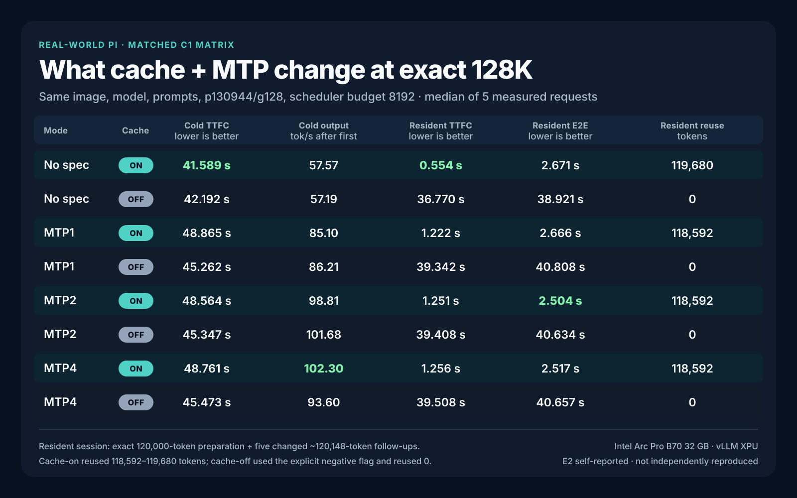

# Intel Arc Pro B70 Inference Cookbook

Open recipes, patches, and measured evidence for local LLM inference on Intel Arc Pro B60/B70 (Battlemage, Xe2).

## Current result: real Pi use at 128K

The current matched campaign compares the same model, image, prompts, scheduler, context, and output length across:

- no speculative decoding, MTP1, MTP2, and MTP4;
- prefix caching explicitly enabled and explicitly disabled;
- exact 130,944-token cold prompts plus 128 output tokens;
- changed follow-ups over a prepared 120,000-token session;
- five measured requests per cell after warmup.

**Status:** E2 self-reported evidence with raw internal artifacts and public reproduction commands. It has not been independently reproduced.



### Cold exact 128K

| Mode | Prefix cache | TTFC median (s) | End-to-end median (s) | Client post-first median (tok/s) | MTP acceptance | Free after load (MiB) |
|---|---|---:|---:|---:|---:|---:|
| No spec | On | **41.589** | **43.793** | 57.57 | n/a | 4,824 |
| No spec | Off | 42.192 | 44.413 | 57.19 | n/a | 4,829 |
| MTP1 | On | 48.865 | 50.358 | 85.10 | 90.36% | 3,414 |
| MTP1 | Off | 45.262 | 46.749 | 86.21 | 90.69% | 3,419 |
| MTP2 | On | 48.564 | 49.946 | 98.81 | 80.54% | 2,958 |
| MTP2 | Off | 45.347 | 46.653 | **101.68** | 82.77% | 2,963 |
| MTP4 | On | 48.761 | 50.011 | **102.30** | 61.22% | 2,616 |
| MTP4 | Off | 45.473 | 46.865 | 93.60 | 62.31% | 2,624 |

Cold rows used unique entropy-first prefixes and recorded zero cache-hit tokens. Cache state therefore measures feature overhead, not reuse. `Client post-first` is `(completion tokens - 1) / (request end - first generated token)`, not an engine-native vLLM rate.

### Resident 120K session with changed follow-ups

| Mode | Prefix cache | Reused tokens median | Recomputed tokens median | TTFC median (s) | End-to-end median (s) | Client post-first median (tok/s) |
|---|---|---:|---:|---:|---:|---:|
| No spec | On | 119,680 | 468 | **0.554** | 2.671 | 59.90 |
| No spec | Off | 0 | 120,148 | 36.770 | 38.921 | 59.04 |
| MTP1 | On | 118,592 | 1,556 | 1.222 | 2.666 | 88.57 |
| MTP1 | Off | 0 | 120,148 | 39.342 | 40.808 | 86.64 |
| MTP2 | On | 118,592 | 1,556 | 1.251 | **2.504** | 101.39 |
| MTP2 | Off | 0 | 120,148 | 39.408 | 40.634 | 104.62 |
| MTP4 | On | 118,592 | 1,556 | 1.256 | 2.517 | **104.37** |
| MTP4 | Off | 0 | 120,148 | 39.508 | 40.657 | 110.48 |

The resident scenario prepares one 120,000-token Pi session, retains the generated assistant turn, then asks five different follow-up questions. It is not a repeated identical prompt.

### What the cache changed

| Mode | Resident TTFC speedup | Resident end-to-end speedup | Cold cache-on TTFC change |
|---|---:|---:|---:|
| No spec | **66.32×** | **14.57×** | -1.43% |
| MTP1 | **32.19×** | **15.31×** | +7.96% |
| MTP2 | **31.49×** | **16.23×** | +7.09% |
| MTP4 | **31.46×** | **16.15×** | +7.23% |

Lower latency is better. Positive cold change means cache-on was slower. Prefix caching dominates normal long-session responsiveness; it must not be blended into a cold-prefill claim.

## Practical mode choice

1. **Resident long sessions:** MTP2 + cache on had the best median end-to-end latency: 2.504 seconds.
2. **Fastest first visible token:** no-spec + cache on reached 0.554 seconds in the resident session.
3. **Cold 128K ingestion:** no-spec finished fastest at 43.793 seconds end to end. MTP adds output speed but does not repay its cold-request overhead in a 128-token response.
4. **MTP4:** valid at the exact 131,072-token boundary after the boundary patch, but not the best default in this matched matrix.
5. **Concurrent mixed load:** use no-spec until the XPU mixed speculative/non-speculative GDN path is fixed.

## Reproduce the complete setup

Start here:

- [Full setup, patch order, eight launch commands, and benchmark command](docs/FULL-SETUP-COMMANDS.md)
- [Image and patch compatibility matrix](docs/IMAGE-AND-PATCH-MATRIX.md)
- [Real-world Pi methodology, prior capacity work, and retained failures](docs/REAL-WORLD-PI-BENCHMARKS.md)
- [Machine-readable matched matrix](results/cache-spec-matrix-20260808-summary.json)

One tested launch:

```bash
export MODEL_DIR="$HOME/models/Qwen3.6-35B-A3B-MTP-Preserved-GPTQ-Int4"
bash benchmarks/launch-vllm-128k-mode.sh "$MODEL_DIR" mtp2 on 8000
```

Complete eight-cell campaign:

```bash
bash benchmarks/b70-pi-128k-cache-spec-matched.sh "$MODEL_DIR"
```

Neither command changes the host GPU power cap.

## Current public stack

| Component | Exact value |
|---|---|
| Public image | `vllm/vllm-openai-xpu@sha256:2c427ef477da092eb6f2cdbbbd24950b5fa171565b916db69d4c7bb10e68ca97` |
| Observed vLLM | `v0.26.1rc1.dev457+gc810e5ee9` |
| `vllm-xpu-kernels` | `0.1.12` |
| Model | `llmfan46/Qwen3.6-35B-A3B-uncensored-heretic-Native-MTP-Preserved-GPTQ-Int4` |
| Target weights | GPTQ INT4 |
| Draft weights | Preserved BF16 MTP layer |
| Patch 1 | `patches/patch_mtp_nightly.py` |
| Patch 2 | `patches/patch_mtp_boundary.py` |
| Context | 131,072 tokens |
| Scheduler budget | 8,192 tokens |
| Prefix cache | Explicit `--enable-prefix-caching` or `--no-enable-prefix-caching` |

The historical `intel/vllm:0.21.0-xpu-int4moe` image was local and was never published. Current instructions do not ask readers to pull or substitute it.

## Do not mix result classes

The historical 204.6 tok/s MTP4 number is a short-output peak from a different campaign. It is not the same workload as cold exact 128K, resident 120K follow-ups, or concurrent throughput. Historical peak tables and older LocalMaxxing self-reports remain in the [campaign log](docs/CAMPAIGN-LOG.md) and [real-world report](docs/REAL-WORLD-PI-BENCHMARKS.md), with their original labels.

Current public tables default to:

- exact endpoint prompt and output tokens;
- C1 versus concurrent scope;
- cold versus resident-prefix state;
- cache hit/reuse counts;
- median and sample count;
- timing source and formula;
- image, patch order, model, context, scheduler, and memory settings;
- E2 self-reported status until another operator reproduces the result.

## Repository map

```text
benchmarks/   launchers, exact prompt generator, request harnesses, telemetry
patches/      current nightly patches plus retained historical patches
docs/         setup, methodology, compatibility, and campaign history
results/      compact machine-readable public summaries
research/     kernel and quantization investigations
submissions/  historical self-reported platform payloads
```

## License and contribution

Code is MIT licensed. Measurement reports and prose are CC BY 4.0. See [LICENSE](LICENSE).

A useful reproduction report includes the image digest, model revision, patch hashes and order, complete launch command, actual endpoint token counts, cache state, concurrency, warmup count, all measured samples, failures, and host telemetry.
