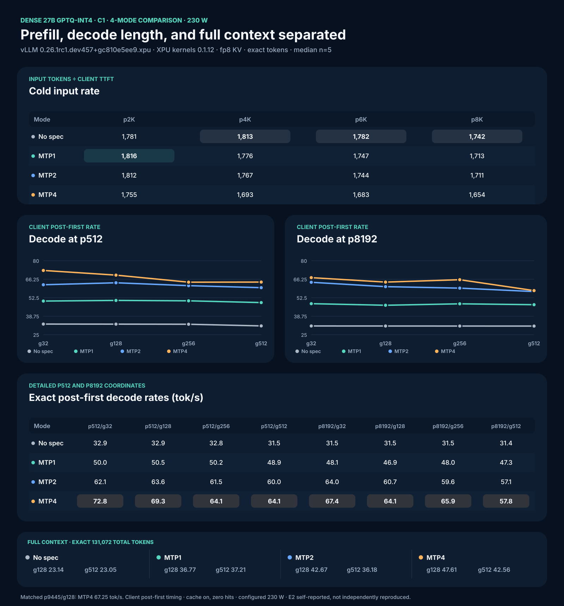

# Intel Arc Pro B70 Inference Cookbook

Repeatable vLLM XPU and llama.cpp SYCL recipes for Intel Arc Pro B60/B70 GPUs.

## Current tested stack

| Component | Exact tested value |
|---|---|
| Public image | `vllm/vllm-openai-xpu@sha256:2c427ef477da092eb6f2cdbbbd24950b5fa171565b916db69d4c7bb10e68ca97` |
| vLLM observed in image | `0.26.1rc1.dev457+gc810e5ee9.xpu` |
| `vllm-xpu-kernels` observed in image | `0.1.12` |
| MoE model | `llmfan46/Qwen3.6-35B-A3B-uncensored-heretic-Native-MTP-Preserved-GPTQ-Int4` |
| Dense model | `llmfan46/Qwen3.6-27B-uncensored-heretic-v2-Native-MTP-Preserved-GPTQ-Int4` |
| Target / draft weights | GPTQ INT4 target / preserved BF16 MTP layer (both models) |
| Patches, in order | `patch_mtp_nightly.py`, then `patch_mtp_boundary.py` |
| MoE context / scheduler / memory | 131,072 / 8,192 / `gpu-memory-utilization=0.85` |
| Dense context / scheduler / memory | 131,072 / 8,192 / `gpu-memory-utilization=0.88` (MTP4) or `0.90` (no-spec/MTP1/MTP2) |
| Dense KV cache | **`fp8` required** — dense 27B needs 9.5 GiB fp16 KV at 128K, which does not fit; fp8 halves it |

PyPI `vllm-xpu-kernels 0.1.12.2` is newer, but it was not installed or tested in this campaign. The historical `intel/vllm:0.21.0-xpu-int4moe` image was local and was never published.

## Short setup

```bash
git clone https://github.com/SergiioB/intel-arc-pro-b70-inference-cookbook.git
cd intel-arc-pro-b70-inference-cookbook
export MODEL_DIR="$HOME/models/Qwen3.6-35B-A3B-MTP-Preserved-GPTQ-Int4"
export MODEL_ID='llmfan46/Qwen3.6-35B-A3B-uncensored-heretic-Native-MTP-Preserved-GPTQ-Int4'
docker pull 'vllm/vllm-openai-xpu@sha256:2c427ef477da092eb6f2cdbbbd24950b5fa171565b916db69d4c7bb10e68ca97'
bash benchmarks/qwen36-35a3/launch-vllm-128k-mode.sh "$MODEL_DIR" mtp2 on 8000
curl -f http://127.0.0.1:8000/health
```

Dense 27B (same image and patches, fp8 KV):

```bash
export DENSE_DIR="$HOME/models/Qwen3.6-27B-MTP-Preserved-GPTQ-Int4"
bash benchmarks/qwen36-27/launch-dense27-128k-mode.sh "$DENSE_DIR" mtp4 on 8000
curl -f http://127.0.0.1:8000/health
```

Use [Full setup commands](docs/FULL-SETUP-COMMANDS.md) for the render-device check, model download and verification, package check, patch hashes, endpoint checks, and full matrix.

Agents updating benchmark graphics should use [the B70 benchmark visuals skill](.agentic/skills/b70-benchmark-visuals/SKILL.md). It renders the dashboard and method diagram from canonical `summary.json`.

## MoE: Qwen3.6-35B-A3B — whole analysis

**Scope for every table below:** one Intel Arc Pro B70, C1, median of `n=5` after one same-output same-shape warmup, prefix cache enabled, unique entropy-first cold prefixes, zero cache-hit delta, scheduler 8,192, context 131,072, configured cap 165 W, client monotonic SSE timing, E2 provisional self-reported evidence. Independent reproduction is pending.

Two model checkpoints were verified on this stack: the `llmfan46/...MTP-Preserved` GPTQ-INT4 (all matrix tables) and the byte-exact `palmfuture/Qwen3.6-35B-A3B-GPTQ-Int4` incl. `mtp.safetensors` (claim-reproduction tests, below).


### Cold prefill proxy: actual input tokens / TTFT, tok/s

| Mode | p512 | p2048 | p4096 | p6144 | p8192 | Full p131071 |
|---|---:|---:|---:|---:|---:|---:|
| No spec | 5,156 | 6,674 | 7,197 | 7,451 | 7,576 | 3,144 |
| MTP1 | 4,840 | 7,377 | 6,999 | 7,189 | 7,264 | 2,679 |
| MTP2 | 4,843 | 7,341 | 7,002 | 7,140 | 7,229 | 2,683 |
| MTP4 | 4,532 | 7,401 | 6,868 | 7,057 | 7,197 | 2,678 |

This rate includes scheduling, uncached prompt processing, and first-token work. It is not isolated engine prefill and is not llama-bench `pp`.

### Decode at p512: client post-first tok/s

| Mode | g32 | g128 | g256 | g512 |
|---|---:|---:|---:|---:|
| No spec | 97.43 | 96.79 | 96.60 | 96.13 |
| MTP1 | 122.21 | 124.57 | 123.82 | 120.58 |
| MTP2 | 162.90 | 153.17 | 148.31 | 141.80 |
| MTP4 | 178.34 | 170.91 | 167.85 | 148.35 |

### Decode at p8192: client post-first tok/s

| Mode | g32 | g128 | g256 | g512 |
|---|---:|---:|---:|---:|
| No spec | 85.92 | 90.34 | 90.91 | 91.26 |
| MTP1 | 108.41 | 118.41 | 118.49 | 117.45 |
| MTP2 | 143.95 | 145.43 | 143.82 | 135.61 |
| MTP4 | 156.28 | 164.36 | 163.89 | 138.03 |

### Historical control: p9445/g128

| Mode | Client post-first median (tok/s) |
|---|---:|
| No spec | 89.68 |
| MTP1 | 116.85 |
| MTP2 | 142.02 |
| MTP4 | 160.42 |

The MTP4 result of 160.42 tok/s reproduces the prior 158.83 tok/s scheduler-control result within 1.0%. It does not make the exact-128K cells equivalent.

### Scheduler and context findings (2026-08-09, focused probes)

`--max-num-batched-tokens` is a cap, not a target: at p4096 both 8,192 and 16,384 prefill in one chunk, yet the larger budget is measurably faster at the same 128K recipe, same seqs 64, same prompts (exact palmfuture checkpoint, 230 W, MTP4):

| Budget | p4096 prefill | g128 decode |
|---|---:|---:|
| 8,192 | 6,525 t/s | 133.1 t/s |
| 16,384 | 7,672 t/s | 149.1 t/s |
| Δ | **+17.6%** | **+12.0%** |

The gain is scheduler/memory-layout, not chunk count. **Do not blanket-adopt 16,384** without testing mixed long-prefill + short-chat loads: one 16K prefill step starves short requests (head-of-line), and activation spikes eat VRAM headroom (128K recipe already loads with ~1 GB free).

Prefill is essentially **flat across context** (p4096 input rate, batch 16,384, seqs 16): 8K ctx 7,727 t/s · 16K 6,622 · 32K 7,740 · 128K 7,672. Context length is not a prefill lever.

### The 12,400 tok/s LocalMaxxing claim — reproduction verdict

We reproduced the claimed config exactly (byte-identical `palmfuture/Qwen3.6-35B-A3B-GPTQ-Int4` incl. `mtp.safetensors`, hash-verified; context 32,768; p4096/g1; batch 16,384; seqs 16; MTP4; fp8 KV; cache off; 230 W). Measured: **7,740 t/s median**, not 12,400. The claim's cited build hash `568afb3a1` is an upstream macOS-CI commit (#49901), not an XPU kernel change — not a meaningful reproduction target; their entry ran vLLM 0.26.1.dev0 on Windows 11, our stack is 0.26.1rc1.dev457 on Linux.

Verdict: `directional_only`, **not reproduced**. The 1.6× gap is build/OS or their prefill definition (their implied TTFT 0.330 s vs our 0.529 s). Evidence: `results/vllm-moe-12k-exact-20260809T190246Z-13717/` and `results/vllm-moe-12k-lowctx-20260809T193408Z-64922/` (raw SSE, monitor, summary.json in the private B70-DOCS repo).

### Full-context decode

| Mode | p130944/g128 (tok/s) | MTP accept | p130560/g512 (tok/s) | MTP accept |
|---|---:|---:|---:|---:|
| No spec | 57.35 | n/a | 57.14 | n/a |
| MTP1 | 84.88 | 89.22% | 82.74 | 85.32% |
| MTP2 | 101.64 | 85.81% | 94.01 | 76.45% |
| MTP4 | 93.53 | 66.91% | 93.83 | 59.81% |

The original no-spec p130560/g512 cell stopped at EOS in three of five requests. It is excluded and retained in the evidence. The 57.14 tok/s row is the forced exact-output replacement.

`Client post-first` is `(completion tokens - 1) / (request end - first generated token)`. It is request-side timing, not engine-native vLLM decode.

## Choose a mode by workload

1. **Short C1 responses:** MTP4 was fastest in the p512 and p8192 g32/g128 cells.
2. **Exact 128K, g128:** MTP2 was fastest at 101.64 client post-first tok/s.
3. **Exact 128K, g512:** MTP2 and MTP4 were effectively tied at 94.01 and 93.83 tok/s in this campaign.
4. **Resident long sessions:** test cache reuse separately. The earlier matched cache campaign found MTP2 + cache on had the best resident end-to-end median.
5. **Mixed long prefill plus short requests:** use no-spec on this stack. The MTP mixed-token XPU path remains unsupported.

## Dense: Qwen3.6-27B — whole analysis

**Scope for every table below:** one Intel Arc Pro B70, C1, median of `n=5` after
one same-output same-shape warmup, prefix cache enabled, unique entropy-first cold
prefixes, zero cache-hit delta, scheduler 8,192, context 131,072,
**`--kv-cache-dtype fp8`** (required for dense 128K), configured cap **230 W**,
client monotonic SSE timing, E2 provisional self-reported evidence. Independent
reproduction is pending. Dense 27B GPTQ-INT4 runs on the pinned nightly via
`XPUwNa16LinearKernel`; both MTP patches apply unchanged to the dense
`Qwen3_5ForConditionalGeneration` architecture (same shared `qwen3_5_mtp.py` /
`gdn_attn.py`).



### Cold input rate: actual input tokens / TTFT, tok/s

| Mode | p2048 | p4096 | p6144 | p8192 |
|---|---:|---:|---:|---:|
| No spec | 1,781 | 1,813 | 1,782 | 1,742 |
| MTP1 | 1,816 | 1,776 | 1,747 | 1,713 |
| MTP2 | 1,812 | 1,767 | 1,744 | 1,711 |
| MTP4 | 1,755 | 1,693 | 1,683 | 1,654 |

This rate includes scheduling, uncached prompt processing, and first-token work.
It is not isolated engine prefill and is not llama-bench `pp`. Dense prefill is
compute-bound (~10% of XMX peak at p4096) and collapses at long context
(p130944 ≈ 547 t/s) — the full-attention O(N²) term.

### Decode at p512: client post-first tok/s

| Mode | g32 | g128 | g256 | g512 |
|---|---:|---:|---:|---:|
| No spec | 32.90 | 32.85 | 32.78 | 31.54 |
| MTP1 | 50.00 | 50.47 | 50.19 | 48.88 |
| MTP2 | 62.15 | 63.59 | 61.45 | 59.95 |
| MTP4 | 72.78 | 69.30 | 64.06 | 64.13 |

### Decode at p8192: client post-first tok/s

| Mode | g32 | g128 | g256 | g512 |
|---|---:|---:|---:|---:|
| No spec | 31.48 | 31.46 | 31.45 | 31.42 |
| MTP1 | 48.08 | 46.90 | 47.97 | 47.33 |
| MTP2 | 63.98 | 60.73 | 59.62 | 57.10 |
| MTP4 | 67.44 | 64.11 | 65.87 | 57.79 |

### Historical control: p9445/g128

| Mode | Client post-first median (tok/s) |
|---|---:|
| No spec | 31.35 |
| MTP1 | 48.41 |
| MTP2 | 60.12 |
| MTP4 | 67.25 |

### Full-context decode (exact 131,072 total tokens)

| Mode | p130944/g128 (tok/s) | MTP accept | p130560/g512 (tok/s) | MTP accept |
|---|---:|---:|---:|---:|
| No spec | 23.14 | n/a | 23.05 | n/a |
| MTP1 | 36.77 | 90.9% | 37.21 | 93.6% |
| MTP2 | 42.67 | 91.1% | 36.18 | 87.8% |
| MTP4 | 47.61 | 89.2% | 42.56 | 75.9% |

MTP acceptance is the totals-diff value per cell (accepted/proposed draft
tokens). Higher acceptance does NOT mean higher throughput: MTP4 leads every
full-context cell despite the lowest per-cell acceptance.

### Measured power draw — matched A/B (2026-08-10, authoritative)

Same mixed workload (1× p2048/g1 prefill + 2× p2048/g128 decode), fresh
entropy prompts, true per-mode server, 230 W cap, monitor windowing only the
active requests, cooldown ≤55°C between modes. Live `energy1_input` deltas,
0.5 s interval average:

| Mode | Mean (W) | Max 0.5s (W) | pkg max (°C) | vram max (°C) |
|---|---:|---:|---:|---:|
| No spec | 149.9 | 238.2 | 70 | 72 |
| MTP4 | 151.0 | 251.5 | 73 | 72 |
| MTP1 | 156.1 | 249.6 | 74 | 74 |
| MTP2 | 153.3 | 242.9 | 72 | 72 |

All four modes within a 6 W band — **MTP depth is not a power lever on dense**.
Max 0.5 s samples above the 230 W cap are short-burst overshoot before the cap
controller engages (card TDP ~300 W). Evidence:
`results/dense27-matched-power-20260809T214116Z/` (private B70-DOCS).

> Earlier campaign-window monitor means (195/197/146/146 W) were coverage
> artifacts — the no-spec/MTP1 windows included the heavy full-context 130K
> prefill cells, and the MTP2 monitor only caught a 223 s decode-only window.
> They must not be cited as a mode-vs-mode power comparison.

### Real Pi workload (MTP4, g128 outputs)

| Scenario | Post-first (tok/s) | TTFT (s) | Cache hits |
|---|---:|---:|---:|
| Cold new conversation | 54.2 | 0.424 | 0 |
| Warm shared system prefix | 62.9 | 0.423 | 0 |
| Warm multi-turn session | 46.9 | 0.477 | 0 |
| New RAG/tool payload on warm session | 55.4 | 0.574 | 0 |
| Warm system + cold 32K document | 43.7 | 25.201 | 0 (1,295 input t/s) |
| Resident-doc follow-up | 52.3 | 2.952 | 29,952 / 32,797 (91.3%) |

Realistic short-turn serving decode is **44–56 t/s**, not the 73 t/s synthetic
peak. Cache reuse eliminates tokens (91.3% hit → TTFT 10.2× faster on the
resident follow-up); it does not speed up per-token prefill.

**Real-world Pi scenario: one document, eight follow-ups (2026-08-10).**
You give Pi a 32K-token document and ask it eight questions in a row. The
first question forces Pi to read the whole document cold — **38.2 s TTFT**.
Every follow-up after that reuses the now-cached document (89.9–94.7% of
prompt tokens) and answers in **2.6–4.9 s** — 8–15× faster — even though the
session keeps growing (32.8K → 33.4K tokens) as each Q&A is appended. The
document is read once, then stays resident; only the new question and reply
are actually processed. Reuse wobbles because the cache matches in 64-token
blocks at the document/conversation boundary. Cache eliminates input tokens —
decode stays flat at 41–56 t/s. Full step-by-step:
[`REAL-WORLD-PI-BENCHMARKS.md`](docs/REAL-WORLD-PI-BENCHMARKS.md).


`Client post-first` is `(completion tokens - 1) / (request end - first generated
token)`. It is request-side timing, not engine-native vLLM decode.

### Dense 27B key constraints

- **fp8 KV is required** for 128K: dense attention needs 9.5 GiB fp16 KV, which
  does not fit at `gpu-memory-utilization` 0.85–0.90; fp8 halves it to ~4.75 GiB
  (156,745–160,799-token capacity).
- **128K is the safe ceiling.** 200K loads but leaves 3 MiB free after load (the
  §6 abort zone); 256K is VRAM-infeasible.
- **MTP4 needs `gpu-memory-utilization=0.88`** — at 0.90 the MTP4 spec buffers
  fill the card (0–2 MiB free). no-spec/MTP1/MTP2 run at 0.90.
- **Power lever:** dense prefill scales with power (+52% at 230 W vs 165 W,
  Run 30); the MoE's power-flatness does not apply to dense.
- **Open blocker:** no FP8 *linear* kernel on XPU (`KeyError: PlatformEnum.XPU`
  in `choose_scaled_mm_linear_kernel`); FP8 checkpoints can't load, INT4 works.
  See `docs/qwen36-27/DENSE-FP8-GAP.md`.

### Dense vs llama.cpp GGUF baseline

The vLLM dense INT4 path is ~2.4–3× faster than the mature llama.cpp GGUF path:
73.2 t/s synthetic C1 decode (MTP4, p512) vs ~24–29 t/s GGUF Q4/Q6-MTP, and
1,754–1,816 t/s cold input vs ~936 t/s llama.cpp prefill at pp4096. Both paths
share the 128K ceiling with MTP; vLLM additionally needs fp8 KV.

## Choose a mode by workload (dense 27B)

1. **Short C1 responses:** MTP4 was fastest in every p512/p8192 g32–g512 cell
   (69.3 tok/s at p512/g128, vs 63.6 MTP2 / 50.5 MTP1 / 32.9 no-spec).
2. **Exact 128K:** MTP4 wins g128 (47.61 tok/s); at g512 MTP4 still leads
   (42.56 vs MTP2 36.18).
3. **Power-sensitive serving:** matched A/B shows no power difference across
   MTP depth (149.9–156.1 W mean at 230 W cap) — choose the mode on speed or
   latency, not draw.
4. **Realistic Pi sessions:** 44–56 t/s decode; MTP4 with cache on gives the
   fastest resident follow-ups (91.3% cache reuse).
5. **Mixed long prefill + short requests:** no-spec is the safe path on this
   stack (MTP4 mixed-token `causal_conv1d` crash remains open).

## Reproduce the matrix

The runner does not change host power. `CONFIGURED_CAP_W` records the cap selected by the operator.

```bash
CONFIGURED_CAP_W=165 \
  bash benchmarks/b70-pi-prefill-decode-matrix.sh "$MODEL_DIR"
```

Dense 27B (same matrix contract, fp8 KV, 230 W, GPU util 0.88 for MTP4):

```bash
CONFIGURED_CAP_W=230 \
  bash benchmarks/qwen36-27/launch-dense27-128k-mode.sh "$DENSE_DIR" mtp4 on 8000
```

Evidence and format:

- [Machine-readable phase-separated result](results/prefill-decode-matrix-20260809-summary.json)
- [Dense 27B machine-readable result](results/qwen36-27/prefill-decode-matrix-20260809-dense27-summary.json)
- [Dense 27B dashboard SVG](docs/assets/b70-dense27-4mode-dashboard.svg)
- [Stable cross-model benchmark format](docs/BENCHMARK-FORMAT.md)
- [Current result plus prior Pi campaigns](docs/REAL-WORLD-PI-BENCHMARKS.md)
- [Image and patch compatibility](docs/IMAGE-AND-PATCH-MATRIX.md)
- [Historical campaign log](docs/CAMPAIGN-LOG.md)

## Correctness limitation

Prompt hashes match across no-spec, MTP1, MTP2, and MTP4. Output parity does not. Depending on the longer-decode cell, only 0 to 4 of 5 repetitions matched exact output text across all four modes. The campaign shows speed and completed exact token shapes, not token, logit, KL, or task-quality parity. Do not use speed as correctness proof.

## Repository map

```text
benchmarks/
  qwen36-35a3/     MoE Qwen3.6-35B-A3B launchers and model-specific campaigns
  qwen36-27/       Dense Qwen3.6-27B launchers (launch-dense27-128k-mode.sh)
  <root>           shared: matrix runner, harness, monitor, prompt generation, compiler, renderers
patches/           current nightly patches and retained historical patches
docs/
  qwen36-35a3/     MoE-specific reference (QUANTIZATION-QUALITY.md)
  qwen36-27/       Dense-specific reference (DENSE-FP8-GAP.md)
  <root>           shared: setup, benchmark contract, methodology, compatibility, history
results/
  qwen36-35a3/     MoE machine-readable summaries and engine grids
  qwen36-27/       Dense summaries (dense27 model card, llama.cpp grids)
  <root>           shared cross-model summaries
research/          kernel and quantization investigations
submissions/       historical self-reported platform payloads (incl. vllm-dense27-mtp4-gptq-int4.json)
```

Model-specific files live under the model directory; cross-model contracts (benchmark format, setup, image/patch matrix) stay at the shared root. The [dense 27B whole-analysis section](#dense-qwen36-27--whole-analysis) above is the entry point for dense results; the MoE analysis sits above it.

Code is MIT licensed. Measurement reports and prose are CC BY 4.0. See [LICENSE](LICENSE).
