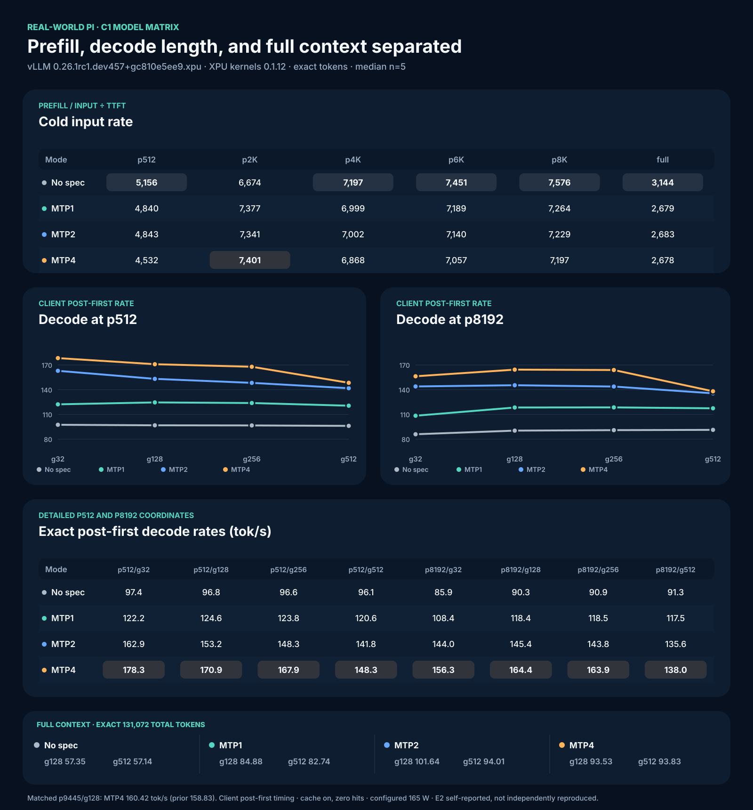

# Intel Arc Pro B70 Inference Cookbook

Repeatable vLLM XPU and llama.cpp SYCL recipes for Intel Arc Pro B60/B70 GPUs.

## Current tested stack

| Component | Exact tested value |
|---|---|
| Public image | `vllm/vllm-openai-xpu@sha256:2c427ef477da092eb6f2cdbbbd24950b5fa171565b916db69d4c7bb10e68ca97` |
| vLLM observed in image | `0.26.1rc1.dev457+gc810e5ee9.xpu` |
| `vllm-xpu-kernels` observed in image | `0.1.12` |
| Model | `llmfan46/Qwen3.6-35B-A3B-uncensored-heretic-Native-MTP-Preserved-GPTQ-Int4` |
| Target / draft weights | GPTQ INT4 target / preserved BF16 MTP layer |
| Patches, in order | `patch_mtp_nightly.py`, then `patch_mtp_boundary.py` |
| Context / scheduler / memory | 131,072 / 8,192 / `gpu-memory-utilization=0.85` |

PyPI `vllm-xpu-kernels 0.1.12.2` is newer, but it was not installed or tested in this campaign. The historical `intel/vllm:0.21.0-xpu-int4moe` image was local and was never published.

## Short setup

```bash
git clone https://github.com/SergiioB/intel-arc-pro-b70-inference-cookbook.git
cd intel-arc-pro-b70-inference-cookbook
export MODEL_DIR="$HOME/models/Qwen3.6-35B-A3B-MTP-Preserved-GPTQ-Int4"
export MODEL_ID='llmfan46/Qwen3.6-35B-A3B-uncensored-heretic-Native-MTP-Preserved-GPTQ-Int4'
docker pull 'vllm/vllm-openai-xpu@sha256:2c427ef477da092eb6f2cdbbbd24950b5fa171565b916db69d4c7bb10e68ca97'
bash benchmarks/launch-vllm-128k-mode.sh "$MODEL_DIR" mtp2 on 8000
curl -f http://127.0.0.1:8000/health
```

Use [Full setup commands](docs/FULL-SETUP-COMMANDS.md) for the render-device check, model download and verification, package check, patch hashes, endpoint checks, and full matrix.

Agents updating benchmark graphics should use [the B70 benchmark visuals skill](.agentic/skills/b70-benchmark-visuals/SKILL.md). It renders the dashboard and method diagram from canonical `summary.json`.

## Phase-separated C1 result

**Scope for every table below:** one Intel Arc Pro B70, C1, median of `n=5` after one same-output same-shape warmup, prefix cache enabled, unique entropy-first cold prefixes, zero cache-hit delta, scheduler 8,192, context 131,072, configured cap 165 W, client monotonic SSE timing, E2 provisional self-reported evidence. Independent reproduction is pending.



### Cold prefill proxy: actual input tokens / TTFT, tok/s

| Mode | p512 | p2048 | p4096 | p6144 | p8192 | Full p131071 |
|---|---:|---:|---:|---:|---:|---:|
| No spec | 5,156 | 6,674 | 7,197 | 7,451 | 7,576 | 3,144 |
| MTP1 | 4,840 | 7,377 | 6,999 | 7,189 | 7,264 | 2,679 |
| MTP2 | 4,843 | 7,341 | 7,002 | 7,140 | 7,229 | 2,683 |
| MTP4 | 4,532 | 7,401 | 6,868 | 7,057 | 7,197 | 2,678 |

This rate includes scheduling, uncached prompt processing, and first-token work. It is not isolated engine prefill and is not llama-bench `pp`.

### Decode at p512: client post-first tok/s

| Mode | g32 | g128 | g256 | g512 |
|---|---:|---:|---:|---:|
| No spec | 97.43 | 96.79 | 96.60 | 96.13 |
| MTP1 | 122.21 | 124.57 | 123.82 | 120.58 |
| MTP2 | 162.90 | 153.17 | 148.31 | 141.80 |
| MTP4 | 178.34 | 170.91 | 167.85 | 148.35 |

### Decode at p8192: client post-first tok/s

| Mode | g32 | g128 | g256 | g512 |
|---|---:|---:|---:|---:|
| No spec | 85.92 | 90.34 | 90.91 | 91.26 |
| MTP1 | 108.41 | 118.41 | 118.49 | 117.45 |
| MTP2 | 143.95 | 145.43 | 143.82 | 135.61 |
| MTP4 | 156.28 | 164.36 | 163.89 | 138.03 |

### Historical control: p9445/g128

| Mode | Client post-first median (tok/s) |
|---|---:|
| No spec | 89.68 |
| MTP1 | 116.85 |
| MTP2 | 142.02 |
| MTP4 | 160.42 |

The MTP4 result of 160.42 tok/s reproduces the prior 158.83 tok/s scheduler-control result within 1.0%. It does not make the exact-128K cells equivalent.

### Full-context decode

| Mode | p130944/g128 (tok/s) | MTP accept | p130560/g512 (tok/s) | MTP accept |
|---|---:|---:|---:|---:|
| No spec | 57.35 | n/a | 57.14 | n/a |
| MTP1 | 84.88 | 89.22% | 82.74 | 85.32% |
| MTP2 | 101.64 | 85.81% | 94.01 | 76.45% |
| MTP4 | 93.53 | 66.91% | 93.83 | 59.81% |

The original no-spec p130560/g512 cell stopped at EOS in three of five requests. It is excluded and retained in the evidence. The 57.14 tok/s row is the forced exact-output replacement.

`Client post-first` is `(completion tokens - 1) / (request end - first generated token)`. It is request-side timing, not engine-native vLLM decode.

## Choose a mode by workload

1. **Short C1 responses:** MTP4 was fastest in the p512 and p8192 g32/g128 cells.
2. **Exact 128K, g128:** MTP2 was fastest at 101.64 client post-first tok/s.
3. **Exact 128K, g512:** MTP2 and MTP4 were effectively tied at 94.01 and 93.83 tok/s in this campaign.
4. **Resident long sessions:** test cache reuse separately. The earlier matched cache campaign found MTP2 + cache on had the best resident end-to-end median.
5. **Mixed long prefill plus short requests:** use no-spec on this stack. The MTP mixed-token XPU path remains unsupported.

## Reproduce the matrix

The runner does not change host power. `CONFIGURED_CAP_W` records the cap selected by the operator.

```bash
CONFIGURED_CAP_W=165 \
  bash benchmarks/b70-pi-prefill-decode-matrix.sh "$MODEL_DIR"
```

Evidence and format:

- [Machine-readable phase-separated result](results/prefill-decode-matrix-20260809-summary.json)
- [Stable cross-model benchmark format](docs/BENCHMARK-FORMAT.md)
- [Current result plus prior Pi campaigns](docs/REAL-WORLD-PI-BENCHMARKS.md)
- [Image and patch compatibility](docs/IMAGE-AND-PATCH-MATRIX.md)
- [Historical campaign log](docs/CAMPAIGN-LOG.md)

## Correctness limitation

Prompt hashes match across no-spec, MTP1, MTP2, and MTP4. Output parity does not. Depending on the longer-decode cell, only 0 to 4 of 5 repetitions matched exact output text across all four modes. The campaign shows speed and completed exact token shapes, not token, logit, KL, or task-quality parity. Do not use speed as correctness proof.

## Repository map

```text
benchmarks/   launchers, prompt generation, request harnesses, telemetry, compiler
patches/      current nightly patches and retained historical patches
docs/         setup, benchmark contract, methodology, compatibility, history
results/      compact machine-readable public summaries
research/     kernel and quantization investigations
submissions/  historical self-reported platform payloads
```

Code is MIT licensed. Measurement reports and prose are CC BY 4.0. See [LICENSE](LICENSE).
