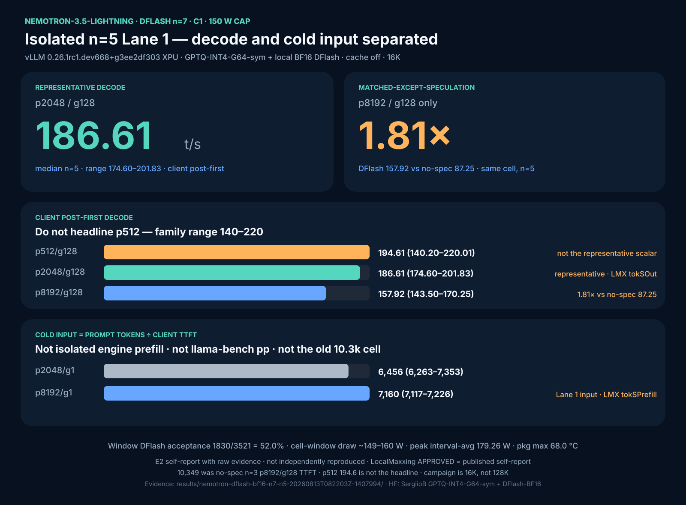

# Nemotron-3.5-Lightning + DFlash on the B70 (vLLM XPU)

Status: **E2 self-report with raw evidence.** Isolated C1 n=5 Lane 1 card.
Eligible as a LocalMaxxing self-report. **Not independently reproduced.**
Copy numbers only from [CLAIMS.md](CLAIMS.md).

This page is the **DFlash** recipe. The no-spec graph path (93 / 87 t/s) stays
on [NEMOTRON-B70.md](NEMOTRON-B70.md). Do not mix those tables.

## What this is

NVIDIA Nemotron-3.5-Lightning-30B-A3B (hybrid Mamba2 + LatentMoE, 3B active)
served on one Intel Arc Pro B70 32 GB with:

1. a **local symmetric GPTQ INT4 G64** target
2. a **local NVFP4→BF16 DFlash** draft
3. vLLM `method=dflash`, `num_speculative_tokens=7`
4. XPU graphs (PIECEWISE+FULL) + native grouped-topk v2 + SSU B8/W4

Native MTP on this stack historically accepts **0%**. DFlash is the working
speculator.

## Stack (do not substitute)

| Component | Exact tested value |
|---|---|
| Public image digest | `vllm/vllm-openai-xpu@sha256:1da0a95485455f08588c11080b9718992fd7d434c6a965d74654903a9d999c57` |
| Local derived tag used here | `vllm-openai-xpu:1da0a954-det0123` (grouped-GEMM `at::zeros` + Muse paged-decode tuple baked in). **Not on Docker Hub.** Reproduce by applying those two kernel edits to the public digest, or run the public digest if you accept the graph-determinism caveat. |
| vLLM | `0.26.1rc1.dev668+g3ee2df303` |
| `vllm-xpu-kernels` | `0.1.12.3` |
| Target | [`SergiioB/Nemotron-3.5-Lightning-30B-A3B-GPTQ-INT4-G64-sym`](https://huggingface.co/SergiioB/Nemotron-3.5-Lightning-30B-A3B-GPTQ-INT4-G64-sym) |
| Draft | [`SergiioB/Nemotron-3.5-Lightning-30B-A3B-DFlash-BF16`](https://huggingface.co/SergiioB/Nemotron-3.5-Lightning-30B-A3B-DFlash-BF16) |
| Source BF16 | `nvidia/NVIDIA-Nemotron-3.5-Lightning-30B-A3B-BF16` |
| Source DFlash | `nvidia/NVIDIA-Nemotron-3.5-Lightning-30B-A3B-NVFP4-DFlash` |
| Runtime patches | `patches/patch_xpu_grouped_topk_native_v2.py`, `patches/ssu-b70-b8w4/` |
| Context / batch / seqs | **120,000** serving limit / 8,192 / `max_num_seqs=1`. Speed card remains the isolated 16K n=5 matrix |
| Cache | **explicitly off** (`--no-enable-prefix-caching`) |
| Power | configured **150 W** |

## Measured (isolated n=5, C1, cache off, 150 W)

Timing is **client monotonic SSE**. Decode = `(completion_tokens-1)/(end-first)`.
Input = `prompt_tokens / TTFT` (**cold input rate**, not isolated engine prefill).

Canonical evidence (private host log):
`results/nemotron-dflash-bf16-n7-n5-20260813T082203Z-1407994/`
(benchmark-history Run 36).



| Cell | Metric | n | median | min | max | acceptance |
|------|--------|--:|-------:|----:|----:|-----------:|
| p2048/g1 | cold input (tok/s) | 5 | 6455.6 | 6262.9 | 7353.3 | — |
| p8192/g1 | cold input (tok/s) | 5 | **7160.1** | 7117.3 | 7226.3 | — |
| p512/g128 | C1 client post-first | 5 | 194.61 | 140.20 | 220.01 | 45.1% |
| **p2048/g128** | C1 client post-first | 5 | **186.61** | 174.60 | 201.83 | 56.5% |
| p8192/g128 | C1 client post-first | 5 | 157.92 | 143.50 | 170.25 | 53.0% |

- Representative decode for any single scalar: **186.6 t/s** (p2048/g128).
  Do **not** headline p512 194.6 (41% family range).
- Window DFlash acceptance **1830/3521 = 52.0%**.
- After load (16K speed card): 5826 MiB `visible_avail`.
- Context **capacity** (Run 38, not a speed card): `max-model-len=120000`
  loaded (5328 MiB free, KV 295,000) and completed staged C1 requests through
  **p119872+g32 = 119,904** tokens. **128K was not run.**
- Cell-window draw ~149–160 W; peak interval-average 179.3 W; pkg max 68.0 °C.
  Raw `energy1_input` / temp samples are in the private Run 36 directory
  (`monitor.jsonl`); not mirrored in this public repo.
- Deterministic raw-completion replay smoke: `exact_match=true` (smoke only).

### Matched-except-speculation

Same target, same image family, no-spec n=5 p8192/g128 = **87.25 t/s**.
DFlash p8192/g128 = **157.92 t/s** → **1.81× on that cell only**.

### The “10k prefill” number

An earlier no-spec n=3 screen showed ~10,349 tok/s from p8192/**g128** TTFT.
That is a different cell, n=3, and it is still a cold input rate. Isolated
DFlash Lane 1 input is **7160** at p8192/**g1** n=5. Do not say “DFlash hit 10k
prefill.”

## Step-by-step reproduce

### 1. Empty GPU

One engine only. ~31,000+ MiB `visible_avail`. Stop any production
`vllm-dense-profile` / `llama-profile` and pin `Restart=no` if those units
exist. `docker rm` alone will respawn a `Restart=on-failure` unit.

### 2. Pull the public image

```bash
docker pull vllm/vllm-openai-xpu@sha256:1da0a95485455f08588c11080b9718992fd7d434c6a965d74654903a9d999c57
```

If you have the local det rebuild (`1da0a954-det0123`), use that tag so the
grouped-GEMM atomic is `at::zeros`. Otherwise apply that one-word kernel fix
before treating graph replay as deterministic.

### 3. Download the two artifacts

```bash
# Target ~18 GB
huggingface-cli download SergiioB/Nemotron-3.5-Lightning-30B-A3B-GPTQ-INT4-G64-sym \
  --local-dir "$HOME/models/Nemotron-3.5-Lightning-30B-A3B-GPTQ-INT4-G64-sym"

# Draft ~1.7 GB
huggingface-cli download SergiioB/Nemotron-3.5-Lightning-30B-A3B-DFlash-BF16 \
  --local-dir "$HOME/models/Nemotron-3.5-Lightning-30B-A3B-DFlash-BF16"
```

Confirm the draft has **no** live `hf_quant_config.json` (only a `.bak` is
safe). If present, rename it or vLLM will treat the draft as NVFP4.

### 4. Launch

```bash
export TARGET="$HOME/models/Nemotron-3.5-Lightning-30B-A3B-GPTQ-INT4-G64-sym"
export DRAFT="$HOME/models/Nemotron-3.5-Lightning-30B-A3B-DFlash-BF16"
bash benchmarks/nemotron35-30a3/launch-nemotron-dflash.sh "$TARGET" "$DRAFT" 8001
curl -f http://127.0.0.1:8001/health
```

### 5. Smoke

```bash
curl -s http://127.0.0.1:8001/v1/completions \
  -H 'Content-Type: application/json' \
  -d '{"model":"nemotron-gptq-dflash7","prompt":"Return exactly this: SMOKE","max_tokens":32,"temperature":0,"seed":42}'
```

You should see tokens. Spec counters (`vllm:spec_decode_num_accepted_tokens_total`)
must increase. 0% acceptance means you are on the MTP path or the draft did not
load.

## Convert it yourself (optional)

Target (symmetric GPTQ INT4 G64) and draft (NVFP4 E2M1 → BF16) converters live
in the private research tree (`scripts/tmp/b70-nvfp4-dflash-to-bf16.py` and the
GPTQ lineage in `research/nemotron-lightning-optimization-20260811/`). The
published HF repos are the reproduction default.

Draft conversion contract:

- E2M1 low-nibble-first × `float8_e4m3fn` × F32 `weight_scale_2`, group 16, linear
- copy attention / embeddings / norms (already BF16)
- strip `quantization_config` and rename leftover ModelOpt json

## LocalMaxxing

Self-reported record `cmsr9po4w000ams01e4fc5qhj` (2026-08-13T08:40:16Z),
status `APPROVED` = published self-report, **not** independently verified.

Displayed: `tokSOut=186.6`, `tokSPrefill=7160`,
`GPTQ-INT4-G64-sym-local+DFlash-BF16-local`, engine `vllm`.

Platform parser limitation: `specDecoding=false` / `specMethod=null` even
though the command snippet and notes carry `method=dflash` n=7.

## Changelog

- 2026-08-13: isolated n=5 DFlash proof. n=3 screen superseded.
- 2026-08-13: HF artifacts published under `SergiioB/` (canonical two-i account).
