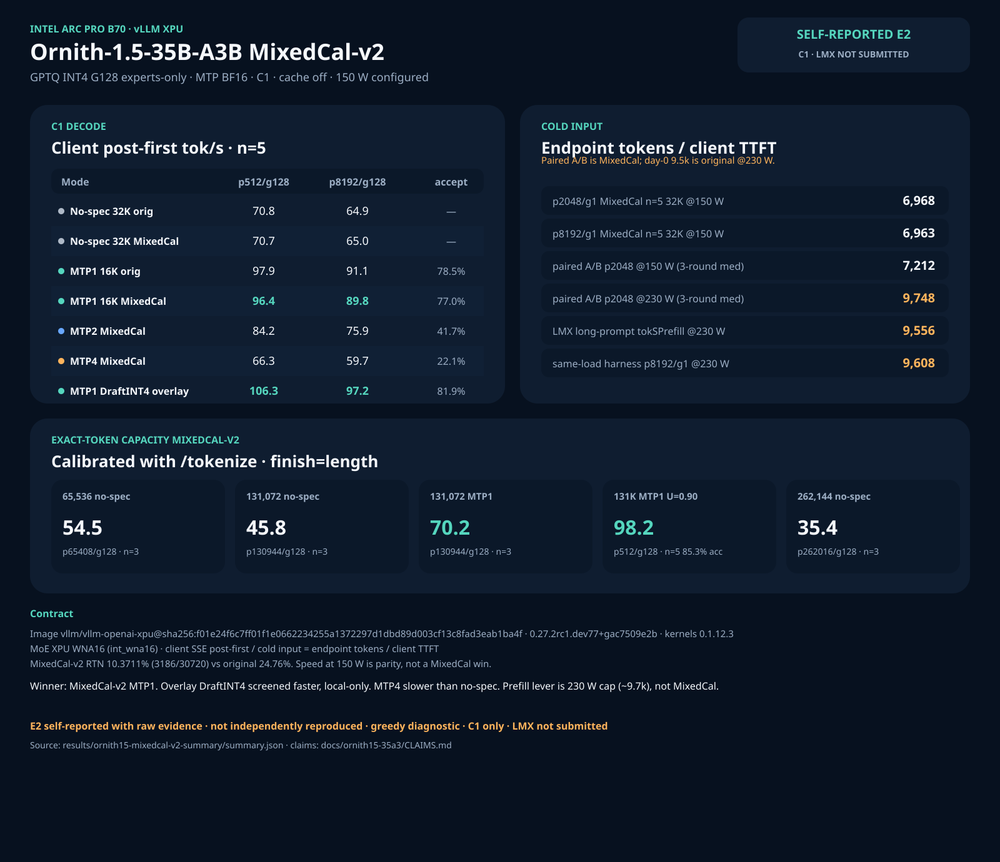

# Ornith-1.5-35B-A3B on Intel Arc Pro B70 (vLLM XPU)

> Isolated C1, cache off, greedy diagnostic. Self-reported E2 with raw
> evidence; not independently reproduced. LocalMaxxing not submitted.
> Copy numbers only from [CLAIMS.md](CLAIMS.md).



Ornith 1.5 is a `qwen3_5_moe` hybrid GDN MoE with the same measured topology as
Qwen3.6-35B-A3B: 40 layers, hidden 2048, 256 experts × 8 active, 30 GDN + 10
full-attn, one MTP layer (785 tensors). There is no official GPTQ. The B70
target is a local experts-only GPTQ INT4 symmetric G128 with MTP left in BF16.

MixedCal-v2 is the current research artifact: same format and tensor scope as
the original WikiText GPTQ, different calibration. Speed at 150 W is **parity**.
The conversion win is RTN fallback **10.37% vs 24.76%**, not tok/s.

## Stack (do not substitute)

| Component | Exact tested value |
|---|---|
| Public image | `vllm/vllm-openai-xpu@sha256:f01e24f6c7ff01f1e0662234255a1372297d1dbd89d003cf13c8fad3eab1ba4f` |
| vLLM | `0.27.2rc1.dev77+gac7509e2b` |
| `vllm-xpu-kernels` | `0.1.12.3` |
| Model | MixedCal-v2 GPTQ INT4 G128, MTP BF16 (see download below) |
| Patches | `patch_mtp_boundary.py` **required for exact max-len MTP**. `patch_mtp_nightly.py` is already-in-image if `quantize_config.json` excludes `mtp`. |
| Never on C1 | `patch_gdn_mixed_split_v5.py` |
| Context / util / seqs | 16,384 (MTP) or 32,768 / 65,536 / 131,072 / 262,144 (no-spec ladder) / `gpu-memory-utilization=0.85` / `max-num-seqs=8` |
| KV | fp16 auto (only 10 full-attn layers; fp8 KV is not required) |
| Cache | `--no-enable-prefix-caching` |
| Power | configured **150 W** for the tables on this page |

This is the **same image digest** as Qwen3.8-27B, not the Qwen3.6 Pi `2c427ef`
digest and not the historical `intel/vllm:0.21.0-xpu-int4moe` native-int4moe
image that produced Qwen3.6 MTP4 **204.6** tok/s. Do not mix those generations.

## 1. Download

```bash
huggingface-cli download SergiioB/Ornith-1.5-35B-A3B-GPTQ-Int4-sym-G128-MTP-BF16-MixedCal-v2 \
  --local-dir "$HOME/models/Ornith-1.5-35B-A3B-GPTQ-Int4-sym-G128-MTP-BF16-MixedCal-v2"
```

Measured local path on the reference host:

```text
/mnt/ornith-mixedcal-workspace/Ornith-1.5-35B-A3B-GPTQ-Int4-sym-G128-MTP-BF16-MixedCal-v2
```

Contract to verify after download:

- 6 shards, ~22.77 GiB
- 30,720 routed-expert `qweight` tensors
- 785 `mtp.*` tensors, **zero** MTP `qweight`
- `quantize_config.json`: 4-bit, `sym=true`, `group_size=128`, `desc_act=false`

## 2. Launch (recommended research serve: MTP1, 16K, cache off)

```bash
export IMAGE='vllm/vllm-openai-xpu@sha256:f01e24f6c7ff01f1e0662234255a1372297d1dbd89d003cf13c8fad3eab1ba4f'
export MODEL_DIR="$HOME/models/Ornith-1.5-35B-A3B-GPTQ-Int4-sym-G128-MTP-BF16-MixedCal-v2"
bash benchmarks/ornith15-35a3/launch-ornith-mtp1.sh "$MODEL_DIR" 16384 8000
```

Exact flags used in the n=5 MTP1 confirmation:

```text
--quantization gptq
--dtype float16
--max-model-len 16384
--gpu-memory-utilization 0.85
--kv-cache-dtype auto
--max-num-seqs 8
--max-num-batched-tokens 8192
--block-size 64
--no-enable-prefix-caching
--language-model-only
--trust-remote-code
--speculative-config {"method":"mtp","num_speculative_tokens":1}
```

For exact 131,072-token MTP completions, apply `patches/patch_mtp_boundary.py`
inside the container before `vllm serve` (see launcher `BOUNDARY=1`).

## 3. Measured (150 W, C1, cache off)

Timing is **client monotonic SSE**. Decode = client post-first tok/s.
Cold input = actual endpoint prompt tokens / client TTFT. Not llama-bench pp/tg.

### No-spec 32K — n=5 confirmation, instance-median of 3 loads

| Cell | Original | MixedCal-v2 |
|---|---:|---:|
| p512/g128 client post-first | 70.80 | 70.74 |
| p8192/g128 client post-first | 64.86 | 64.95 |
| p2048/g1 cold input | 6935 | 6968 |
| p8192/g1 cold input | 6926 | 6963 |

### MTP1 16K — n=5

| Artifact | p512/g128 | p8192/g128 | Acceptance |
|---|---:|---:|---|
| Original | 97.88 | 91.06 | 78.5% |
| MixedCal-v2 | 96.43 | 89.85 | 77.0% |

### MixedCal-v2 long context

| Cell | n | client post-first | Notes |
|---|---:|---:|---|
| MTP1 131K U=0.90 p512/g128 | 5 | 98.16 | accept 85.3% |
| MTP1 131K U=0.90 p8192/g128 | 5 | 95.25 | same window |
| exact p65408/g128 no-spec | 3 | 54.49 | 65,536 serve |
| exact p130944/g128 no-spec | 3 | 45.84 | 131,072 serve |
| exact p130944/g128 MTP1 | 3 | 70.25 | boundary patch |
| exact p262016/g128 no-spec | 3 | 35.35 | 262,144 + `--kv-cache-memory 6623879680` |

### MTP depth A/B — 16K, 150 W, n=5

| Artifact | MTP1 p512 | MTP2 p512 | MTP4 p512 | MTP4 accept |
|---|---:|---:|---:|---|
| Original | 97.88 | 82.03 | 64.35 | 20.4% |
| MixedCal-v2 | 96.43 | 84.16 | 66.27 | 22.1% |

MTP4 is slower than no-spec. Do not serve `num_speculative_tokens=4` on this head.

Do not read the 262K cell as a quality or sustained-decode headline. It is a
capacity completion at C1.

## 4. Why MTP1, not MTP4

Single-layer MTP head. Day-0 original artifact, n=3, 230 W: per-position
acceptance **81 / 15 / 2.5 / 0.5%**. Depth-4 spends verify budget on near-zero
later positions. Depth-1 keeps the strong pos0 (~78–85% on MixedCal n=5) and
is the research default.

This inverts Qwen3.8-27B dense (MTP4 optimal) and is **not** the Qwen3.6-35B
MTP4 204.6 result. That 204.6 cell was C1 MTP4 p-short/g32 on vLLM **0.21**
native int4moe + int8-store + BF16 MTP draft, not this WNA16 nightly.

## 5. Prefill lever

Paired A/B on one warm MixedCal-v2 no-spec 32K server, cache off, three
alternating rounds, matched except configured cap:

| Cap | p2048/g1 round medians | p8192/g1 round medians |
|---|---|---|
| 150 W | 7271 / 7212 / 7055 | 7036 / 7050 / 7062 |
| 230 W | 9748 / 9713 / 9771 | 9647 / 9683 / 9670 |

230 W recovers the day-0 **~9.5–9.7k** cold-input class. 150 W stays **~7.1k**.
The prefill lever on this WNA16 nightly is **power cap**, not MixedCal vs
original and not a native-int4moe backport. Campaign-window draw was **~152 W**
vs **~222 W**. GT clocks were **not** pinned; there is no clock-only A/B.
After each 230→150 drop the first retained p2048 sample is ~8.7k before later
samples settle ~6.9k; do not treat that first sample as 150 W sustained.

Native int4moe + int8-store (the Qwen3.6 204.6 generation) remains a separate
image and is not required to explain the 9.5k day-0 prefill.

Prefill ~9.7k vs decode ~96 is **not** a broken decode path. Prefill is a
wide GEMM over thousands of prompt tokens and saturates XMX; raising
`power1_cap` 150→230 W lifts that class ~7.1k→~9.7k. Decode is
memory-latency bound at batch 1 (plus one MTP draft token). No-spec
p512/g128 is **70.74** at 150 W; MTP1 is **96.43**. That ~100× ratio is
the same shape as Nemotron DFlash (7160 cold input vs 186 decode) on this
card. Do not compare Ornith MTP1 96 to Qwen3.6 MTP4 **204.6**: that cell
is a different image generation (v0.21 native int4moe + int8-store,
short g32).

DFlash would attack **decode**, not prefill. Status: **no Ornith DFlash
draft is served**. See §6.

## 5b. LocalMaxxing long-prompt prefill at 230 W (no-spec)

The 150 W LocalMaxxing default is a **32-token** prompt (`tokSPrefill` 654.7).
That is not the 9.7k class. The 9.7k class was re-measured on MixedCal-v2
no-spec 32K at configured **230 W** with a unique-entropy long prompt.

Exact serve flags for this cell (do not substitute MTP1 here):

```text
vllm/vllm-openai-xpu@sha256:f01e24f6c7ff01f1e0662234255a1372297d1dbd89d003cf13c8fad3eab1ba4f
--quantization gptq
--dtype float16
--max-model-len 32768
--gpu-memory-utilization 0.85
--kv-cache-dtype auto
--max-num-seqs 8
--max-num-batched-tokens 8192
--block-size 64
--no-enable-prefix-caching
--language-model-only
--trust-remote-code
# no --speculative-config
```

Startup contract on this load: `enable_prefix_caching: False`,
`speculative_config=None`, vLLM `0.27.2rc1.dev77+gac7509e2b`. Prefix-cache
hits and queries stayed **0**. Post-load VRAM 5608 MiB free.

| Source | Actual prompt tokens | Statistic | Cold input |
|---|---:|---|---:|
| LMX `--prompt` unique entropy, `--max-tokens 1`, warmup 1, n=5 | 2899 | `tokSPrefill` median | **9556.4** |
| same-load harness p2048/g1 n=4 valid TTFT | ~2887–2896 | median endpoint tokens / client TTFT | **9428** |
| same-load harness p8192/g1 n=5 | ~11356–11366 | median | **9608** |
| paired A/B MixedCal p2048/g1 @230 W (3-round medians) | ~2k class | per-round median | 9748 / 9713 / 9771 |

LMX `validate-local` **valid**. **Not submitted.** Do not publish LMX
`tokSOut` from `max-tokens=1` (19k-class noise). Decode default remains
**MTP1 at 150 W**.

## 6. What will not launch (yet)

| Path | Status |
|---|---|
| DFlash2 | **No Ornith / hidden-2048 DFlash2 draft.** Rahul's Arc Pro post is SGLang TP4 Qwen3.8-27B AWQ + `incoai/Qwen3.8-27B-DFlash2`. On this same `f01e24f6` image, Qwen3.8 DFlash2 overlay loaded then accepted **0%**; later causal-fallback n=5 was **22.41 tok/s / 24.7% accept** — worse than MTP4. Keep MTP1 here. |
| DFlash v1 `z-lab/Qwen3.5-35B-A3B-DFlash` | Hidden 2048 / vocab 248320 **match** Ornith topology. Kernels still gated. **Not measured.** Not a recipe. |
| DraftINT4 S+M1 | Overlay applied at load (`B70_DRAFT_LMHEAD_INT4` + `B70_DRAFT_MTP_INT4`). DI1 MTP1 n=5: **106.27 / 97.16** vs BF16-draft S8 **96.43 / 89.85**, accept 81.9% vs 77.0%. Optional, local-only; weights stay BF16 MTP. Do not enable GDN mixed-split on C1. |
| GDN mixed-split v5 | Cn candidate only. |

## 7. Power

Discover the `xe` hwmon node; do not hard-code `hwmon4` on a new host.

```bash
# restore 150 W after research
HWMON=$(python3 - <<'PY'
import glob, os
xs=[h for h in glob.glob('/sys/class/hwmon/hwmon*')
    if open(h+'/name').read().strip()=='xe']
print(xs[0])
PY
)
echo 150000000 | sudo tee "$HWMON/power1_cap"
```

## Evidence

Machine-readable compiler: in the host research tree,
`results/ornith15-mixedcal-v2-summary/summary.json`. Claims lock:
[CLAIMS.md](CLAIMS.md).
