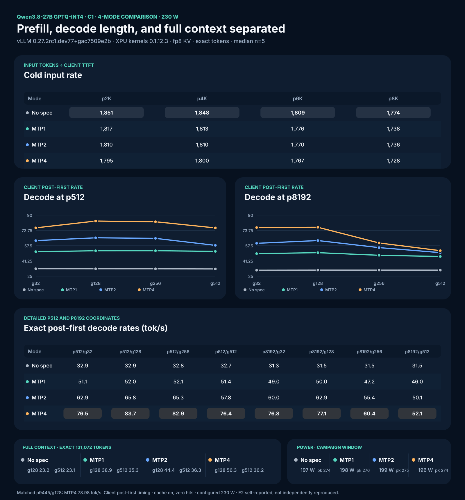

# Qwen3.8-27B vLLM XPU 4-Mode Recipe



## 1. Model download from Hugging Face
Download the exact preserved-MTP artifact using the Hugging Face CLI. The model repository contains 16 files totaling ~18.2 GiB. We pin to the `9d189a60` revision to ensure exact replication.

```bash
huggingface-cli download SergiioB/Qwen3.8-27B-GPTQ-Int4-sym-G128-MTP-BF16 \
  --revision 9d189a60e4c0ad7f9f47cd94bfa393ca10b3924e \
  --local-dir /qw38-gptq-out/Qwen3.8-27B-GPTQ-Int4-sym-G128-MTP-BF16
```

Verify the artifact integrity and correct exclusion of the `mtp.*` tensors from quantization (they must remain BF16):
```bash
sha256sum /qw38-gptq-out/Qwen3.8-27B-GPTQ-Int4-sym-G128-MTP-BF16/*.safetensors
cat /qw38-gptq-out/Qwen3.8-27B-GPTQ-Int4-sym-G128-MTP-BF16/quantize_config.json
```
The config must show `gptq` with 4-bit, sym=true, group_size=128, desc_act=false, and dynamically excluded `mtp.*` tensors.

## 2. Why GPTQ-Int4?
Intel's XMX engines are integer-first hardware. GPTQ-Int4 is the demonstrated optimal fast path for vLLM XPU on the B70, utilizing the `XPUwNa16LinearKernel`. Other formats fall short on this stack:
- **NVFP4:** Proprietary to NVIDIA, unsupported on Intel silicon.
- **FP8 block:** Currently lacks an optimized XPU scaling kernel in vLLM.
- **GGUF:** The converter strips the required MTP head, breaking speculative decoding.
- **AWQ / compressed-tensors:** Not proven or fully optimized on this exact stack.

This exact `sym G128 desc_act=false` contract with 400 quantized weight tensors and 15 preserved BF16 MTP tensors was quantized directly on the B70 XPU using `gptqmodel` 7.3.2 to ensure native compatibility.

## 3. Image and package verification
Pull the pinned immutable container image:
```bash
export IMAGE='vllm/vllm-openai-xpu@sha256:f01e24f6c7ff01f1e0662234255a1372297d1dbd89d003cf13c8fad3eab1ba4f'
docker pull "$IMAGE"
```

Verify the exact package versions and device detection inside the container:
```bash
docker run --rm --device /dev/dri --entrypoint python "$IMAGE" -c '
from importlib.metadata import version
import torch
assert version("vllm") == "0.27.2rc1.dev77+gac7509e2b"
assert version("vllm-xpu-kernels") == "0.1.12.3"
print(torch.xpu.get_device_name(0))
'
```
It must print `Intel Arc Pro B70`.

## 4. Patches
We apply two critical patches in strict order (both located in the `patches/` directory of the cookbook):
1. `patch_mtp_nightly.py` (SHA-256: `f1db50bf617aacbb0a672daf172be32a98b2a73c7817ebab0c6317b22d11f36a`): Enables the BF16 draft build gate by reading `B70_MTP_BF16_DRAFT=1`.
2. `patch_mtp_boundary.py` (SHA-256: `41d2f74e5fef1f074b76b5a90dd1016de437228431802cfb1fa7bd7ce4cc9b50`): Correctly handles the partial final speculative group at the exact 131,072-token boundary.

## 5. Power cap
Resolve your `xe` hwmon path (PCI 0000:0b:00.0) and set the 230 W configured cap:
```bash
# Example path, confirm via /sys/class/hwmon/hwmon*/name == 'xe'
echo 230000000 | sudo tee /sys/class/hwmon/hwmon4/power1_cap
```
*Note: A 300 W write is rejected by the driver; readback stays at the 230 W hardware ceiling. There is no clock control on the `xe` driver (no gt_min/gt_max). Under a 230 W cap load, the PMU reports actual frequencies of 3,400 MHz against requested 2,400 MHz.* Restore to 150 W after benchmark completion.

## 6. Launch commands (per mode)
Run the server for each mode sequentially.

### no-spec
```bash
docker run -d --name qw38speed -p 8000:8000 --device /dev/dri --group-add $(stat -c '%g' /dev/dri/render* | sort -u | head -1) \
  -v /dev/dri:/dev/dri:ro -v /qw38-gptq-out/Qwen3.8-27B-GPTQ-Int4-sym-G128-MTP-BF16:/model:ro \
  -v patches/patch_mtp_nightly.py:/patch_mtp.py:ro -v patches/patch_mtp_boundary.py:/patch_boundary.py:ro \
  -e VLLM_TARGET_DEVICE=xpu -e ZE_FLAT_DEVICE_HIERARCHY=COMPOSITE -e ZE_AFFINITY_MASK=0 \
  -e B70_MTP_BF16_DRAFT=1 -e VLLM_XPU_ENABLE_XPU_GRAPH=1 -e PYTORCH_ALLOC_CONF=expandable_segments:True \
  --entrypoint bash "$IMAGE" -lc \
  "set -e; python /patch_mtp.py; python /patch_boundary.py; exec vllm serve /model --quantization gptq --dtype float16 --max-model-len 131072 --gpu-memory-utilization 0.90 --kv-cache-dtype fp8 --port 8000 --max-num-seqs 64 --max-num-batched-tokens 8192 --no-enable-prefix-caching --served-model-name qwen38 --language-model-only"
```

### MTP1 / MTP2 / MTP4
For MTP runs, drop `--gpu-memory-utilization` to `0.88` to fit draft buffers, and append the speculative config. For example, MTP4:
```bash
docker run -d --name qw38speed -p 8000:8000 --device /dev/dri --group-add $(stat -c '%g' /dev/dri/render* | sort -u | head -1) \
  -v /dev/dri:/dev/dri:ro -v /qw38-gptq-out/Qwen3.8-27B-GPTQ-Int4-sym-G128-MTP-BF16:/model:ro \
  -v patches/patch_mtp_nightly.py:/patch_mtp.py:ro -v patches/patch_mtp_boundary.py:/patch_boundary.py:ro \
  -e VLLM_TARGET_DEVICE=xpu -e ZE_FLAT_DEVICE_HIERARCHY=COMPOSITE -e ZE_AFFINITY_MASK=0 \
  -e B70_MTP_BF16_DRAFT=1 -e VLLM_XPU_ENABLE_XPU_GRAPH=1 -e PYTORCH_ALLOC_CONF=expandable_segments:True \
  --entrypoint bash "$IMAGE" -lc \
  "set -e; python /patch_mtp.py; python /patch_boundary.py; exec vllm serve /model --quantization gptq --dtype float16 --max-model-len 131072 --gpu-memory-utilization 0.88 --kv-cache-dtype fp8 --port 8000 --max-num-seqs 64 --max-num-batched-tokens 8192 --no-enable-prefix-caching --served-model-name qwen38 --language-model-only --speculative-config '{\"method\":\"mtp\",\"num_speculative_tokens\":4}'"
```

## 7. Results
*Stack: vLLM 0.27.2rc1.dev77+gac7509e2b, XPU kernels 0.1.12.3, fp8 KV, scheduler 8192, context 131072, 230 W configured cap, cache disabled (zero hits), C1, client monotonic timing. All medians n=5 unless noted.*

### Cold input rate (input tokens / client TTFT, tok/s)
| Mode | p2048/g1 | p4096/g1 | p6144/g1 | p8192/g1 |
|---|---:|---:|---:|---:|
| no-spec | 1851 | 1848 | 1809 | 1774 |
| mtp1 | 1817 | 1813 | 1776 | 1738 |
| mtp2 | 1810 | 1810 | 1770 | 1736 |
| mtp4 | 1795 | 1800 | 1767 | 1728 |

### Decode at p512 (client post-first tok/s)
| Mode | g32 | g128 | g256 | g512 |
|---|---:|---:|---:|---:|
| no-spec | 32.9 | 32.9 | 32.8 | 32.7 |
| mtp1 | 51.1 | 52.0 | 52.1 | 51.4 |
| mtp2 | 62.9 | 65.8 | 65.3 | 57.8 |
| mtp4 | 76.5 | 83.7 | 82.9 | 76.4 |

### Decode at p8192 (client post-first tok/s)
| Mode | g32 | g128 | g256 | g512 |
|---|---:|---:|---:|---:|
| no-spec | 31.3 | 31.5 | 31.5 | 31.5 |
| mtp1 | 49.0 | 50.0 | 47.2 | 46.0 |
| mtp2 | 60.0 | 62.9 | 55.4 | 50.1 |
| mtp4 | 76.8 | 77.1 | 60.4 | 52.1 |

*Note: The mtp4 p8192/g32 cell contains one corrupted rep5 (41587.9 tok/s SSE burst); the median 76.8 is unaffected and valid, but the cell mean must not be published.*

### Control + full-context
| Mode | p9445/g128 | p130944/g128 (n=1) | p130560/g512 (n=1) |
|---|---:|---:|---:|
| no-spec | 31.4 | 23.2 | 23.1 |
| mtp1 | 49.9 | 38.9 | 35.3 |
| mtp2 | 62.3 | 44.4 | 36.3 |
| mtp4 | 79.0 | 56.3 | 36.2 |

### MTP acceptance per mode (accepted/proposed, %)
| Mode | p512/g128 | p8192/g128 | p130944/g128 |
|---|---:|---:|---:|
| mtp1 | 100.0 | 99.7 | 100.0 |
| mtp2 | 99.3 | 97.7 | 96.5 |
| mtp4 | 95.0 | 93.7 | 96.2 |

### Power (campaign-window, includes warmups)
| Mode | mean W | max 0.5s interval-avg W |
|---|---:|---:|
| no-spec | 197 | 274 |
| mtp1 | 198 | 276 |
| mtp2 | 199 | 275 |
| mtp4 | 196 | 274 |

## 8. Benchmark harness reproduction
Reproduce the 4-mode characterization with unique entropy-first prefixes, zero cache-hit delta, exact rendered tokens, same-shape warmups, C1 only, and client monotonic timing:

```bash
python3 benchmarks/b70-realworld-context-harness.py
```

The shared matrix runner is `benchmarks/b70-pi-prefill-decode-matrix.sh`.

## 9. LocalMaxxing Submission
LocalMaxxing submission id `cmsur82fz06svms01ga1f0z83` APPROVED.
- **Payload:** `submissions/vllm-qwen38-mtp4-gptq-int4.json`
- **Scores:** 83.7 tok/s decode, 1774 tok/s prefill, 131072 ctx.

## 10. Running the pi coding agent on this model
See [PI-AGENT-BACKEND.md](PI-AGENT-BACKEND.md) — vLLM flags for tool calling
(`--enable-auto-tool-choice --tool-call-parser qwen3_xml`), the pi
`models.json` provider entry, and verified agent usage.

Sampling parameters are set per thinking mode by the extension
(`patches/pi/qwen38-vllm-thinking.ts`) exactly as recommended on the official
Qwen3.8-27B model card — thinking `temperature=1.0, top_p=0.95, top_k=20,
presence_penalty=0.0`; non-thinking `temperature=0.7, top_p=0.80, top_k=20,
presence_penalty=1.5`; `repetition_penalty=1.0` both modes.

## 11. Draft INT4 S+M1 (research, env default off)

See [DRAFT-INT4-S-M1.md](DRAFT-INT4-S-M1.md). Do not headline +51% against
this champion recipe. Pair with a compact+scatter GDN split if you also
need mixed spec + prefill; the original full-buffer split is OOB on
kernels 0.1.12.3.

