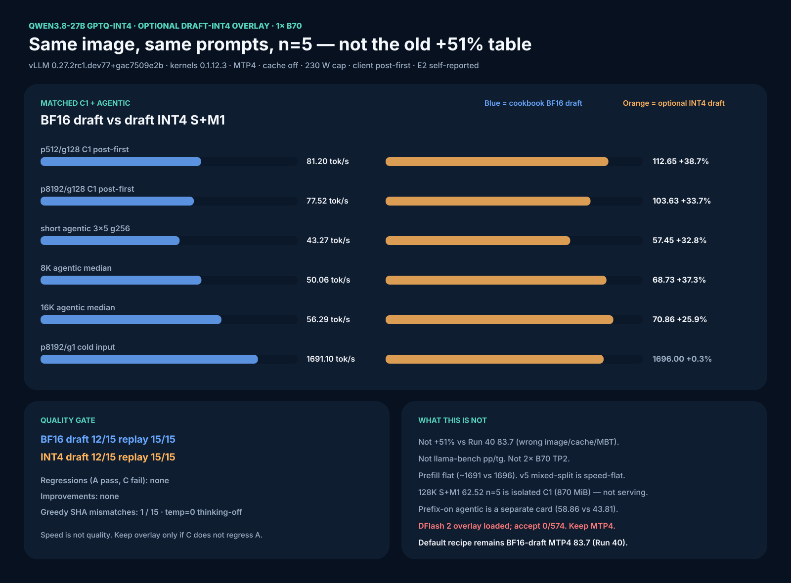

# Qwen3.8-27B vLLM XPU 4-Mode Recipe


The 4-mode dashboard is the **BF16-draft** Run 40 card (MTP4 p512/g128 **83.7**).
The optional draft-INT4 overlay is a separate matched n=5 card:



Generation length + isolated-C1 128K on that same S+M1 arm (not a serving
headline; 870 MiB free after load):


Prefix-on agentic A/B (separate campaign, cache on, isolated C1):


## 1. Model download from Hugging Face
Download the exact preserved-MTP artifact using the Hugging Face CLI. The model repository contains 16 files totaling ~18.2 GiB. We pin to the `9d189a60` revision to ensure exact replication.

```bash
huggingface-cli download SergiioB/Qwen3.8-27B-GPTQ-Int4-sym-G128-MTP-BF16 \
  --revision 9d189a60e4c0ad7f9f47cd94bfa393ca10b3924e \
  --local-dir /qw38-gptq-out/Qwen3.8-27B-GPTQ-Int4-sym-G128-MTP-BF16
```

Verify the artifact integrity and correct exclusion of the `mtp.*` tensors from quantization (they must remain BF16):
```bash
sha256sum /qw38-gptq-out/Qwen3.8-27B-GPTQ-Int4-sym-G128-MTP-BF16/*.safetensors
cat /qw38-gptq-out/Qwen3.8-27B-GPTQ-Int4-sym-G128-MTP-BF16/quantize_config.json
```
The config must show `gptq` with 4-bit, sym=true, group_size=128, desc_act=false, and dynamically excluded `mtp.*` tensors.

## 2. Why GPTQ-Int4?
Intel's XMX engines are integer-first hardware. GPTQ-Int4 is the demonstrated optimal fast path for vLLM XPU on the B70, utilizing the `XPUwNa16LinearKernel`. Other formats fall short on this stack:
- **NVFP4:** Proprietary to NVIDIA, unsupported on Intel silicon.
- **FP8 block:** Currently lacks an optimized XPU scaling kernel in vLLM.
- **GGUF:** The converter strips the required MTP head, breaking speculative decoding.
- **AWQ / compressed-tensors:** Not proven or fully optimized on this exact stack.

This exact `sym G128 desc_act=false` contract with 400 quantized weight tensors and 15 preserved BF16 MTP tensors was quantized directly on the B70 XPU using `gptqmodel` 7.3.2 to ensure native compatibility.

## 3. Image and package verification
Pull the pinned immutable container image:
```bash
export IMAGE='vllm/vllm-openai-xpu@sha256:f01e24f6c7ff01f1e0662234255a1372297d1dbd89d003cf13c8fad3eab1ba4f'
docker pull "$IMAGE"
```

Verify the exact package versions and device detection inside the container:
```bash
docker run --rm --device /dev/dri --entrypoint python "$IMAGE" -c '
from importlib.metadata import version
import torch
assert version("vllm") == "0.27.2rc1.dev77+gac7509e2b"
assert version("vllm-xpu-kernels") == "0.1.12.3"
print(torch.xpu.get_device_name(0))
'
```
It must print `Intel Arc Pro B70`.

## 4. Patches
Required, in this order (both in `patches/`):
1. `patch_mtp_nightly.py` (SHA-256: `4d7a02c4ea10ca7c00dc89ad927fa3dafa747dbf0553d2adf24e30a3c53e9c14`): Enables the BF16 draft build gate by reading `B70_MTP_BF16_DRAFT=1`.
2. `patch_mtp_boundary.py` (SHA-256: `41d2f74e5fef1f074b76b5a90dd1016de437228431802cfb1fa7bd7ce4cc9b50`): Correctly handles the partial final speculative group at the exact 131,072-token boundary.

Optional, after those two, still Qwen-only (never Nemotron grouped-topk / SSU):
3. `patch_gdn_mixed_split_v5.py` — mixed spec + non-spec `gdn_attention` compact+scatter. Cn correctness; C1 speed-flat.
4. `patch_draft_lmhead_int4.py` then `patch_draft_mtp_int4.py` with `B70_DRAFT_LMHEAD_INT4=1` and `B70_DRAFT_MTP_INT4=1` — draft-side INT4 RTN. MTP speed overlay. Quality still gated.

Copy-paste launch lines including the optional overlays: [FULL-SETUP-COMMANDS.md §11](../FULL-SETUP-COMMANDS.md).

## 5. Power cap
Resolve your `xe` hwmon path (PCI 0000:0b:00.0) and set the 230 W configured cap:
```bash
# Example path, confirm via /sys/class/hwmon/hwmon*/name == 'xe'
echo 230000000 | sudo tee /sys/class/hwmon/hwmon4/power1_cap
```
*Note: A 300 W write is rejected by the driver; readback stays at the 230 W hardware ceiling. There is no clock control on the `xe` driver (no gt_min/gt_max). Under a 230 W cap load, the PMU reports actual frequencies of 3,400 MHz against requested 2,400 MHz.* Restore to 150 W after benchmark completion.

## 6. Launch commands (per mode)
Run the server for each mode sequentially.

### no-spec
```bash
docker run -d --name qw38speed -p 8000:8000 --device /dev/dri --group-add $(stat -c '%g' /dev/dri/render* | sort -u | head -1) \
  -v /dev/dri:/dev/dri:ro -v /qw38-gptq-out/Qwen3.8-27B-GPTQ-Int4-sym-G128-MTP-BF16:/model:ro \
  -v patches/patch_mtp_nightly.py:/patch_mtp.py:ro -v patches/patch_mtp_boundary.py:/patch_boundary.py:ro \
  -e VLLM_TARGET_DEVICE=xpu -e ZE_FLAT_DEVICE_HIERARCHY=COMPOSITE -e ZE_AFFINITY_MASK=0 \
  -e B70_MTP_BF16_DRAFT=1 -e VLLM_XPU_ENABLE_XPU_GRAPH=1 -e PYTORCH_ALLOC_CONF=expandable_segments:True \
  --entrypoint bash "$IMAGE" -lc \
  "set -e; python /patch_mtp.py; python /patch_boundary.py; exec vllm serve /model --quantization gptq --dtype float16 --max-model-len 131072 --gpu-memory-utilization 0.90 --kv-cache-dtype fp8 --port 8000 --max-num-seqs 64 --max-num-batched-tokens 8192 --no-enable-prefix-caching --served-model-name qwen38 --language-model-only"
```

### MTP1 / MTP2 / MTP4
For MTP runs, drop `--gpu-memory-utilization` to `0.88` to fit draft buffers, and append the speculative config. For example, MTP4:
```bash
docker run -d --name qw38speed -p 8000:8000 --device /dev/dri --group-add $(stat -c '%g' /dev/dri/render* | sort -u | head -1) \
  -v /dev/dri:/dev/dri:ro -v /qw38-gptq-out/Qwen3.8-27B-GPTQ-Int4-sym-G128-MTP-BF16:/model:ro \
  -v patches/patch_mtp_nightly.py:/patch_mtp.py:ro -v patches/patch_mtp_boundary.py:/patch_boundary.py:ro \
  -e VLLM_TARGET_DEVICE=xpu -e ZE_FLAT_DEVICE_HIERARCHY=COMPOSITE -e ZE_AFFINITY_MASK=0 \
  -e B70_MTP_BF16_DRAFT=1 -e VLLM_XPU_ENABLE_XPU_GRAPH=1 -e PYTORCH_ALLOC_CONF=expandable_segments:True \
  --entrypoint bash "$IMAGE" -lc \
  "set -e; python /patch_mtp.py; python /patch_boundary.py; exec vllm serve /model --quantization gptq --dtype float16 --max-model-len 131072 --gpu-memory-utilization 0.88 --kv-cache-dtype fp8 --port 8000 --max-num-seqs 64 --max-num-batched-tokens 8192 --no-enable-prefix-caching --served-model-name qwen38 --language-model-only --speculative-config '{\"method\":\"mtp\",\"num_speculative_tokens\":4}'"
```

## 7. Results
*Stack: vLLM 0.27.2rc1.dev77+gac7509e2b, XPU kernels 0.1.12.3, fp8 KV, scheduler 8192, context 131072, 230 W configured cap, cache disabled (zero hits), C1, client monotonic timing. All medians n=5 unless noted.*

### Cold input rate (input tokens / client TTFT, tok/s)
| Mode | p2048/g1 | p4096/g1 | p6144/g1 | p8192/g1 |
|---|---:|---:|---:|---:|
| no-spec | 1851 | 1848 | 1809 | 1774 |
| mtp1 | 1817 | 1813 | 1776 | 1738 |
| mtp2 | 1810 | 1810 | 1770 | 1736 |
| mtp4 | 1795 | 1800 | 1767 | 1728 |

### Decode at p512 (client post-first tok/s)
| Mode | g32 | g128 | g256 | g512 |
|---|---:|---:|---:|---:|
| no-spec | 32.9 | 32.9 | 32.8 | 32.7 |
| mtp1 | 51.1 | 52.0 | 52.1 | 51.4 |
| mtp2 | 62.9 | 65.8 | 65.3 | 57.8 |
| mtp4 | 76.5 | 83.7 | 82.9 | 76.4 |

### Decode at p8192 (client post-first tok/s)
| Mode | g32 | g128 | g256 | g512 |
|---|---:|---:|---:|---:|
| no-spec | 31.3 | 31.5 | 31.5 | 31.5 |
| mtp1 | 49.0 | 50.0 | 47.2 | 46.0 |
| mtp2 | 60.0 | 62.9 | 55.4 | 50.1 |
| mtp4 | 76.8 | 77.1 | 60.4 | 52.1 |

*Note: The mtp4 p8192/g32 cell contains one corrupted rep5 (41587.9 tok/s SSE burst); the median 76.8 is unaffected and valid, but the cell mean must not be published.*

### Control + full-context
| Mode | p9445/g128 | p130944/g128 (n=1) | p130560/g512 (n=1) |
|---|---:|---:|---:|
| no-spec | 31.4 | 23.2 | 23.1 |
| mtp1 | 49.9 | 38.9 | 35.3 |
| mtp2 | 62.3 | 44.4 | 36.3 |
| mtp4 | 79.0 | 56.3 | 36.2 |

### MTP acceptance per mode (accepted/proposed, %)
| Mode | p512/g128 | p8192/g128 | p130944/g128 |
|---|---:|---:|---:|
| mtp1 | 100.0 | 99.7 | 100.0 |
| mtp2 | 99.3 | 97.7 | 96.5 |
| mtp4 | 95.0 | 93.7 | 96.2 |

### Power (campaign-window, includes warmups)
| Mode | mean W | max 0.5s interval-avg W |
|---|---:|---:|
| no-spec | 197 | 274 |
| mtp1 | 198 | 276 |
| mtp2 | 199 | 275 |
| mtp4 | 196 | 274 |

## 8. Benchmark harness reproduction
Reproduce the 4-mode characterization with unique entropy-first prefixes, zero cache-hit delta, exact rendered tokens, same-shape warmups, C1 only, and client monotonic timing:

```bash
python3 benchmarks/b70-realworld-context-harness.py
```

The shared matrix runner is `benchmarks/b70-pi-prefill-decode-matrix.sh`.

## 9. LocalMaxxing Submission
LocalMaxxing `APPROVED` means accepted self-report, not independent verification.

- **BF16-draft MTP4 (cookbook default):** id `cmsur82fz06svms01ga1f0z83`. Payload `submissions/vllm-qwen38-mtp4-gptq-int4.json`. `tokSOut` **83.7** = client post-first p512/g128 median n=5; `tokSPrefill` **1774** = no-spec p8192/g1 input/TTFT. Do not overwrite this row with the draft-INT4 overlay.
- **Draft-INT4 S+M1 overlay (optional):** id `cmszpqy000e8fms014ty6i5x3` APPROVED. Payload `submissions/vllm-qwen38-mtp4-draft-int4.json`. `tokSOut` **112.65** = same p512/g128 cell, n=5 median, vs matched BF16-draft arm **81.20** on 2026-08-18. `tokSPrefill` **1696** = MTP4 p8192/g1 on that arm (flat vs 1691). Speed-only; accept 94.4% vs 95.9%.

## 10. Running the pi coding agent on this model
See [PI-AGENT-BACKEND.md](PI-AGENT-BACKEND.md) — vLLM flags for tool calling
(`--enable-auto-tool-choice --tool-call-parser qwen3_xml`), the pi
`models.json` provider entry, and verified agent usage.

Sampling parameters are set per thinking mode by the extension
(`patches/pi/qwen38-vllm-thinking.ts`) exactly as recommended on the official
Qwen3.8-27B model card — thinking `temperature=1.0, top_p=0.95, top_k=20,
presence_penalty=0.0`; non-thinking `temperature=0.7, top_p=0.80, top_k=20,
presence_penalty=1.5`; `repetition_penalty=1.0` both modes.

## 11. Concurrent MTP4 (optional overlay, not a C1 speed keep)

Unpatched `gdn_attention` on this XPU stack refuses mixed spec-decode +
non-spec tokens in one invocation (`vllm-xpu-kernels#510`). C1 never hits
that path. Two-plus in-flight requests (Pi agent, mixed long-prefill +
decode) can kill EngineCore.

Use **`patches/patch_gdn_mixed_split_v5.py`** (also shipped as
`patch_gdn_split_mixed.py`, same compact+scatter v5 algorithm) after the
two MTP patches:

- compact each group (`index_select`), `token_indx = arange`, idle side `None`
- `index_copy_` both `core_attn_out` and `z`
- patches every `_xpu_ops.py` copy; fail closed if the call-site anchor is missing

Do **not** apply the original full-buffer + global-`token_indx` split on
kernels `0.1.12.3`. The fused host binding narrows tensors to
`num_actual_tokens`; global mixed indices are OOB.

Optional `patches/patch_mtp_ptr_wrap.py` wraps **int64** `data_ptr` stores
only. Do not wrap uint64 `dst_ptrs_np`. Overflow was seen on legacy
`2c427ef` GGUF drafter logs, not on this champion image.

Same-image n=5 on this champion stack: C1 decode **speed-flat** vs
cookbook MTP4 (81.37 vs 81.20 tok/s median at p512/g128). Mixed
decode-first + long prefill: cookbook EngineCore dead, v5 **3/3 alive**.

## 12. Draft INT4 S+M1 (optional Qwen3.8 MTP4 speed keep)

See [DRAFT-INT4-S-M1.md](DRAFT-INT4-S-M1.md). Runtime RTN INT4 of the
**draft** LM head and five MTP linears. Target body and verify head stay
GPTQ-INT4 / BF16. Env: `B70_DRAFT_LMHEAD_INT4=1` and
`B70_DRAFT_MTP_INT4=1` (patches default off; set both for this keep).
Pair with v5 mixed-split if you also need mixed spec + prefill.

Same-image n=5 vs cookbook BF16 draft (`f01e24f6`, MTP4, cache off,
MBT 8192, C1, 230 W configured cap, client post-first):

| Cell | Cookbook BF16 draft | Draft INT4 S+M1 | Δ |
|---|---:|---:|---:|
| p512/g128 median n=5 | 81.20 tok/s (78.76–81.97) | **112.65** (111.58–117.73) | **+38.7%** |
| p8192/g128 median n=5 | 77.52 | **103.63** (99.10–107.70) | **+33.7%** |
| p8192/g1 cold input | 1691.1 | 1696.0 | +0.3% (flat) |
| short agentic 3×5 g256 (**cache off**) | 43.27 | **57.45** | **+32.8%** |
| MTP accept p512/g128 | 510/532 = 95.86% | 510/540 = 94.44% | −1.4 pp |
| measured median W p512/g128 | 195.2 | 205.0 | — |

Long-context C1 agentic (g128, 0 crashes, **cache off**): 8K median **68.73 vs 50.06
(+37%)**; 16K **70.86 vs 56.29 (+26%)**. 32K was isolated C1 with
~245 MiB free — **+5% only, not a serving headline**. Keep this table
separate from the prefix-on campaign below.

Temperature-0 15-task A/B (2026-08-19): **12/15 both arms**, 15/15 greedy
replay, **zero C-only regressions**. Shared fails are a safety refusal
(needle) and two `max_tokens` truncations with identical SHA. Keep the
overlay optional. Do **not** headline +51%. The Run 40 83.7 card is the
BF16-draft default; 112.65 is the overlay.

Same-arm generation + isolated C1 128K (2026-08-19, n=5, cache off,
230 W cap, client post-first). After-load free VRAM **870 MiB** —
isolated C1 only, not preferred-perf, not a serving headline.
Dashboard: [b70-qwen38-draft-int4-ctx-gen.svg](../assets/b70-qwen38-draft-int4-ctx-gen.svg).
Full table: [DRAFT-INT4-S-M1.md](DRAFT-INT4-S-M1.md).

| Cell | median | max | accept | n |
|---|---:|---:|---:|--:|
| p512/g32 | 101.57 | 102.73 | 84.9% | 5 |
| p512/g256 | 110.76 | 112.87 | 89.0% | 5 |
| p512/g512 | 101.20 | 112.71 | 81.2% | 5 |
| p8192/g32 | 93.92 | 94.64 | 86.5% | 5 |
| p8192/g256 | 75.75 | 80.33 | 62.5% | 5 |
| p8192/g512 | 64.96 | 72.22 | 51.6% | 5 |
| p16384/g128 | 94.92 | 95.41 | 92.6% | 5 |
| p32768/g128 | 88.25 | 91.59 | 93.8% | 5 |
| p65536/g128 | 76.72 | 79.79 | 94.8% | 5 |
| p98304/g128 | 67.93 | 70.50 | 93.4% | 5 |
| p130944/g128 isolated C1 | 62.52 | 65.57 | 92.6% | 5 |

p130944+g128 completed 131,072 tokens 5/5. g32 is not sustained. Do not
mix these client rates with the Run 40 83.7 / n=1 56.3 BF16-draft rows.

### Prefix-on agentic (2026-08-19, Run 43)

Separate campaign from the cache-off agentic rows above. Same image, MTP4,
C1, configured **230 W**, client post-first. Server logs
`enable_prefix_caching: True`. After-load **865 / 871 MiB** → isolated C1
only. Comparison: `matched_except_quant` (INT4 draft vs BF16 draft). Do
**not** subtract these from cache-off agentic, and do **not** overwrite
the 83.7 LMX row.

Client post-first tok/s, median, C1, prefix cache on, 230 W cap configured:

| Cell | Cookbook BF16 draft | Draft INT4 S+M1 | Δ |
|---|---:|---:|---:|
| short coding 3×5 g256 (3 sessions, 15 turns) | 43.81 | **58.86** | **+34.4%** |
| 8K start g128 (3 sessions, 15 turns) | 48.04 | **66.99** | **+39.4%** |
| 16K start g128 (2 sessions, 8 turns) | 54.40 | **65.92** | **+21.2%** |

Short t1 cache-hit delta = 0; t5 = 1664 tokens/session. Long t2+ hits
4992–18304. Prefix cache did **not** make decode faster than the cache-off
agentic campaign. Speed only; quality KEEP 12/15 is from the prior suite.

Raw: `B70-DOCS/results/qwen38-agentic-cacheon-20260819T093858Z/`. SVG:
[b70-qwen38-draft-int4-agentic-cacheon.svg](../assets/b70-qwen38-draft-int4-agentic-cacheon.svg).

## 13. DFlash 2 — loads on a research overlay, 0% accept (not a recipe)

[`incoai/Qwen3.8-27B-DFlash2`](https://huggingface.co/incoai/Qwen3.8-27B-DFlash2)
(Apache-2.0, ~3.85 GB, `architectures: ["DFlash2DraftModel"]`) is a **new**
block-diffusion drafter ([blog](https://inco.ai/blog/dflash2/)). Official
serve line is vLLM `method: dflash` + `num_speculative_tokens: 7` on
**vLLM PR #52816** (`DFlash2Qwen3ForCausalLM` + Triton `DFlash2Speculator`).
That PR is **open** and CUDA-oriented. This champion image only registers
DFlash **v1** (`DFlashDraftModel`). Relabeling the checkpoint as v1 is an
architecture mismatch — do not do it.

Measured 2026-08-19 on `f01e24f6` + GPTQ target + official DFlash2 draft
(`results/qwen38-dflash2-smoke-20260819T071612Z/`, C1, cache off, 230 W
cap, `n=7`):

| Step | Result |
|---|---|
| Unpatched image | `SpeculativeConfig`: `DFlash2DraftModel` not supported |
| Registry-only overlay | loads as v1 `DFlashQwen3Model` — no `candidate_selector` |
| Overlay + `model_cls` / V2-runner hooks, no v5 | weights load; warmup dies on XPU `causal_conv1d` mixed spec/prefill |
| Overlay + v5 mixed-split | `/health` 200, greedy `pong` ok, 4645 MiB free |
| Spec window | **Accepted 0 / Drafted 574 = 0.0%** (all 7 positions 0) |
| One-shot p512-ish g128 | client post-first **19.18 tok/s** (`n=1`, not a median) |

That 19 tok/s is worse than no-spec on this target. Drafting happened;
verification accepted nothing. **Keep MTP4 as the serving spec.** This is
not a Lane 1 card and not a cookbook apply-list item. Never apply Nemotron
DFlash patches to this family.
