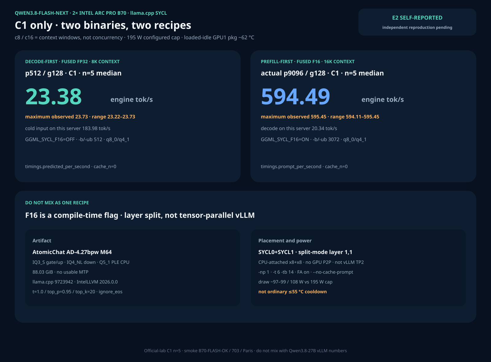
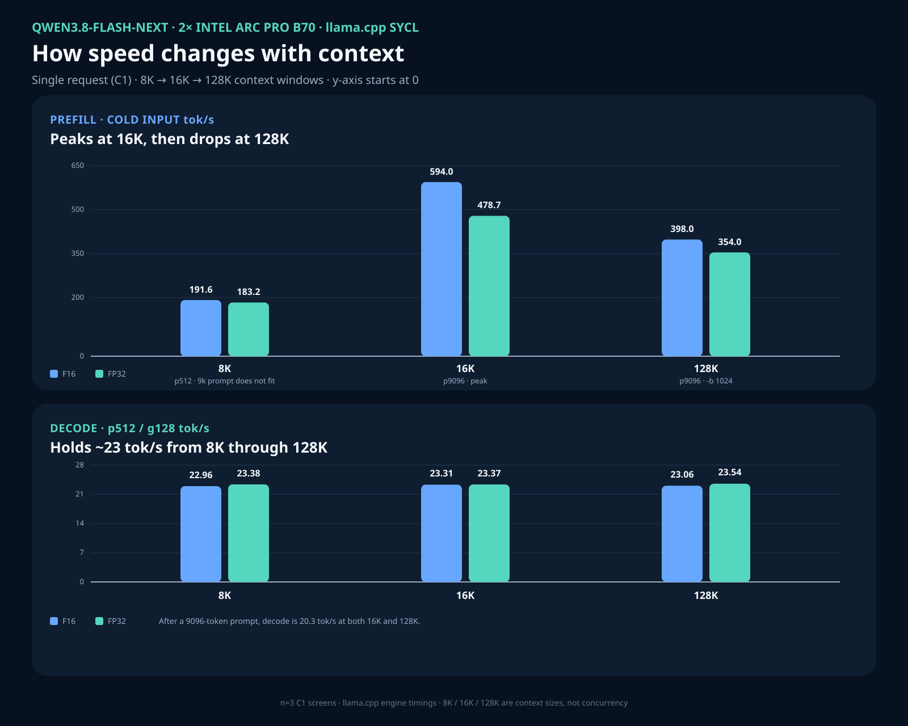

# Qwen3.8-Flash-Next — dual B70 llama.cpp SYCL (C1)

Status: **official-lab self-report, E2** for the two n=5 leader cells.
Context-length and GPU-grouping screens are **provisional n=3**. Independent
reproduction is pending. This is **not** the Qwen3.8-27B vLLM GPTQ or FP8 TP2
recipe.

[Family hub](README.md) · [image/patch matrix](../IMAGE-AND-PATCH-MATRIX.md) ·
[catalog](../BENCHMARK-CATALOG.md)

`c8`, `c16`, and `c128` on this page are **configured context windows**.
Every measured request is **C1**: `llama-server -np 1`, one client, idle slot
between samples. They are not concurrency 8/16/128.





## Executive overview

The public route is community GGUF on two Intel Arc Pro B70 cards with
llama.cpp SYCL. Weights are mixed **IQ3_S** (gate/up) and **IQ4_NL** (down);
the Hugging Face folder name `Q4_K_M` is not a uniform Q4_K_M quant. Per-layer
token embeddings stay on CPU/NVMe as Q5_1 mmap. Compute experts split
`--tensor-split 1,1 --split-mode layer`. There is no GPU P2P on this
CPU-attached x8+x8 host, and there is no usable MTP in this M64 artifact.

`GGML_SYCL_F16` is a **global build flag**. Pick **one** binary per server:

- **Decode-first:** fused FP32 (`GGML_SYCL_F16=OFF`) at 8K context.
- **Prefill-first:** fused F16 (`GGML_SYCL_F16=ON`) at 16K context, `-b/-ub 3072`.

Do **not** publish fused-FP32 decode and fused-F16 prefill as one recipe.

The n=5 C1 leaders:

| Recipe | Workload | Median | Maximum observed | n |
|---|---|---:|---:|---:|
| fused FP32, 8K context | p512/g128 decode | **23.38** engine tok/s | 23.73 | 5 |
| fused FP32, 8K context | p512/g128 cold input | **183.98** engine tok/s | 184.13 | 5 |
| fused F16, 16K context | actual p9096/g128 cold input | **594.49** engine tok/s | 595.45 | 5 |
| fused F16, 16K context | actual p9096/g128 decode | 20.34 engine tok/s | 20.64 | 5 |

Decode is llama.cpp HTTP `timings.predicted_per_second`. Cold input is
`timings.prompt_per_second` with `cache_n=0` and `--no-cache-prompt`. These are
engine rates, not llama-bench `pp`/`tg` and not vLLM client post-first.

## 1. Result card: n=5 C1, one discarded warmup

Sampling: temperature 1.0, `top_p=0.95`, `top_k=20`, `ignore_eos`,
`finish_reason=length`, exact 128 generated tokens. Correctness smoke
`B70-FLASH-OK` / `37*19=703` / `Paris` passed on every measured server.

### Decode-first — fused FP32, `-c 8192`, `-b/-ub 512`

Evidence: [`n5-fused-fp32-c8k-p512-g128/summary.json`](../../results/qwen38-flash-next-dual-b70-c1/n5-fused-fp32-c8k-p512-g128/summary.json)

| Statistic | Decode tok/s | Cold input tok/s |
|---|---:|---:|
| **median** | **23.38** | **183.98** |
| min | 23.22 | 183.39 |
| max | 23.73 | 184.13 |
| stdev (decode) | 0.197 | — |

Samples (decode): 23.36, 23.73, 23.38, 23.55, 23.22.
Average card draw over the request interval: GPU0 ~97 W, GPU1 ~108 W.
Configured cap **195 W**. Cap is not measured draw.

### Prefill-first — fused F16, `-c 16384`, `-b/-ub 3072`, actual 9096 prompt tokens

Evidence: [`n5-fused-f16-c16k-p9096-g128/summary.json`](../../results/qwen38-flash-next-dual-b70-c1/n5-fused-f16-c16k-p9096-g128/summary.json)

| Statistic | Cold input tok/s | Decode tok/s |
|---|---:|---:|
| **median** | **594.49** | 20.34 |
| min | 594.11 | 20.03 |
| max | 595.45 | 20.64 |
| stdev (decode) | — | 0.229 |

Samples (cold input): 595.45, 594.11, 595.42, 594.49, 594.35.
Average card draw: GPU0 ~99 W, GPU1 ~108 W.

## 2. Stack

| Field | Value |
|---|---|
| GGUF | `AtomicChat/Qwen3.8-Flash-Next-GGUF` variant `Qwen3.8-Flash-Next-AD-4.27bpw-Q4_K_M-M64`, revision `142262902a46f7daed19c79d0771534c8106ad59`, 33 shards, 88.03 GiB |
| Expert quants | gate/up **IQ3_S**, down **IQ4_NL**, PLE **Q5_1** |
| llama.cpp | `0.3.0-dev` build 492, commit `9723942adc518b43c4b95dc4dce6906903eb5e09` |
| Compiler | IntelLLVM 2026.0.0 |
| Decode binary | `GGML_SYCL_F16=OFF` llama-server SHA-256 `f56a838b0e1a16aa8a1321ce2a217c8f3e972e961cf0aca706f76f4d6421c98b` |
| Prefill binary | `GGML_SYCL_F16=ON` llama-server SHA-256 `2da6e9fc89d9cb68368feb1a2e7ef1045ff705acb16721755ac1f72149dd1ee3` |
| Grouped SYCL lib (n=3 A/B only) | `libggml-sycl.so` SHA-256 `85e7409157a44992c2f14d7af409df5413d40297971c9e8530b0f6a03fa83fae` |
| KV | `q8_0` K + `q4_1` V. `-fa on` is mandatory (`q4_1` V refuses `-fa off`) |
| Threads | `-t 6 -tb 14`. IMM=0. DMMV unset |

Apply patches in this order on that commit:

1. [`patches/llamacpp-sycl/flashnext-arch-overlay.patch`](../../patches/llamacpp-sycl/flashnext-arch-overlay.patch)
2. Decode/prefill n=5: [`sycl-fused-mmvq-iq3s-iq4nl.patch`](../../patches/llamacpp-sycl/sycl-fused-mmvq-iq3s-iq4nl.patch)
3. Optional grouping screen: [`sycl-mmid-gpu-group-20260901.patch`](../../patches/llamacpp-sycl/sycl-mmid-gpu-group-20260901.patch) (includes the fused-MMVQ change). Disable with `GGML_SYCL_DISABLE_MMID_GPU_GROUP=1`.

Identities: [`identities.json`](../../results/qwen38-flash-next-dual-b70-c1/identities.json).

Build both trees from the same patched source if you want both recipes:

```bash
source /opt/intel/oneapi/setvars.sh --force >/dev/null 2>&1
cmake -S . -B build-sycl -DGGML_SYCL=ON -DGGML_SYCL_F16=OFF
cmake --build build-sycl --target llama-server -j
cmake -S . -B build-sycl-f16 -DGGML_SYCL=ON -DGGML_SYCL_F16=ON
cmake --build build-sycl-f16 --target llama-server -j
```

## 3. Serve commands

Empty-GPU gate before load: no `llama-server` / vLLM process, no inference
container, about 31 GiB `visible_avail` per card, restore 150 W then set the
campaign cap to **195 W**. Restore **150 W** on exit.

```bash
export SYCL_PI_LEVEL_ZERO_USE_IMMEDIATE_COMMANDLISTS=0
export SYCL_CACHE_PERSISTENT=0
export SYCL_DEVICE_FILTER=level_zero
export ZE_FLAT_DEVICE_HIERARCHY=COMPOSITE
```

Decode-first (fused FP32, 8K):

```bash
llama-server -m Qwen3.8-Flash-Next-AD-4.27bpw-Q4_K_M-M64-00001-of-00033.gguf \
  --device SYCL0,SYCL1 --tensor-split 1,1 --split-mode layer -ngl 99 \
  -ot 'per_layer_token_embd=CPU' -c 8192 -fa on -t 6 -tb 14 -np 1 \
  -b 512 --ubatch-size 512 --cache-type-k q8_0 --cache-type-v q4_1 \
  --no-warmup --no-cache-prompt --host 127.0.0.1 --port 8001
```

Prefill-first 16K: same flags on the F16 binary with `-c 16384 -b 3072 --ubatch-size 3072`.

128K capacity probe: `-c 131072 -b 1024 --ubatch-size 1024`. `1536+` was
rejected (`n_gpu_layers already set by user to 99`). Do not use `--no-mmap` or
`--mlock` on this ~88 GiB GGUF.

## 4. Thermal disclosure

With the 88 GiB model resident, GPU1 package temperature did **not** fall to
the ordinary ≤55 °C comparison floor (stuck ~62 °C at ~45 W idle for 900 s).
The n=5 cells ran at that loaded-idle plateau. Per-sample package temperature
and `energy1_input` averages are in the public JSON. This is not a matched
cool-card comparison.

## 5. Provisional n=3 context map

Not ranking cells. Evidence: [`n3-context-map.json`](../../results/qwen38-flash-next-dual-b70-c1/n3-context-map.json).

| Binary | Context | Batch | p512 decode | p512 cold input | p9096 decode | p9096 cold input |
|---|---|---:|---:|---:|---:|---:|
| fused FP32 | 8K | 512 | 23.38 | 183.17 | — | — |
| fused FP32 | 16K | 3072 | 23.37 | 183.61 | 20.25 | 478.71 |
| fused FP32 | 128K | 1024 | 23.54 | 183.38 | 20.41 | 353.95 |
| fused F16 | 8K | 512 | 22.96 | 191.55 | — | — |
| fused F16 | 16K | 3072 | 23.31 | 192.64 | 20.40 | 593.98 |
| fused F16 | 128K | 1024 | 23.06 | 195.57 | 20.25 | 398.02 |

128K completed C1 p512/g128 and actual-p9096/g128 requests. That is a
capacity/shape observation, not an n=5 speed card.

## 6. GPU MUL_MAT_ID grouping (n=3 A/B)

Batched `ne12 != 1` no longer D2H-copies expert IDs or host-sorts. Occupancy
counts still D2H so the host can size per-expert F16/oneMKL GEMM. Decode
`ne12==1` fused MMVQ is unchanged.

Matched fused-F16 16K actual-p9096/g128 C1 n=3:

| Mode | Cold input median | Decode median | Evidence |
|---|---:|---:|---|
| GPU group on | **599.48** (598.95–600.74) | 20.30 | [`n3-f16-gpu-group-c16k-p9096-g128`](../../results/qwen38-flash-next-dual-b70-c1/n3-f16-gpu-group-c16k-p9096-g128/summary.json) |
| `GGML_SYCL_DISABLE_MMID_GPU_GROUP=1` | 594.67 (594.09–598.94) | 20.27 | [`n3-f16-gpu-group-off-c16k-p9096-g128`](../../results/qwen38-flash-next-dual-b70-c1/n3-f16-gpu-group-off-c16k-p9096-g128/summary.json) |

Comparison: `matched_exact` except grouping. Prefill **+0.81%**. Decode
unchanged. Below a 3% e2e kernel gate. Grouped IQ3_S/IQ4_NL GEMM was **not**
implemented (SYCL MMQ compile-disabled; F16+XMX already owns large-`ne12`).

## 7. Closed paths and rejected levers

Do not retry as this recipe: vLLM-XPU, AutoRound, official BF16 download as
the serving artifact, GGUF requant, stock `--tensor-parallel-size 2`, native
MTP, n-gram speculation, CPU pin, FA-off, IMM/DMMV sweeps, tensor-split 48,52,
195→230 W, CPU expert offload, `--no-mmap`/`--mlock`.

Speed is not token/logit/KL or task-quality parity. Smoke tests only.

## 8. LocalMaxxing payloads (not yet submitted)

Platform `tokSOut` / `tokSPrefill` are engine rates. `batchSize` and
`numParallel` are 1. `gpuCount` is 2.

- Decode-first: [`submissions/llamacpp-qwen38-flash-next-fused-fp32-c8.json`](../../submissions/llamacpp-qwen38-flash-next-fused-fp32-c8.json) — `tokSOut` 23.38, `tokSPrefill` 183.98, context 8192.
- Prefill-first: [`submissions/llamacpp-qwen38-flash-next-fused-f16-c16.json`](../../submissions/llamacpp-qwen38-flash-next-fused-f16-c16.json) — `tokSOut` 20.34, `tokSPrefill` 594.49, context 16384.

Do not submit a single payload that mixes the FP32 decode median with the F16
prefill median. `LOCALMAXXING_API_KEY` was unset in the publishing session;
payloads are files only.

## 9. Public evidence

- n=5 fused FP32: [`summary.json`](../../results/qwen38-flash-next-dual-b70-c1/n5-fused-fp32-c8k-p512-g128/summary.json)
- n=5 fused F16: [`summary.json`](../../results/qwen38-flash-next-dual-b70-c1/n5-fused-f16-c16k-p9096-g128/summary.json)
- n=3 grouping on/off and context map under [`results/qwen38-flash-next-dual-b70-c1/`](../../results/qwen38-flash-next-dual-b70-c1/)
- Catalog authority: [`data/benchmarks.v1.json`](../../data/benchmarks.v1.json)
